# Procesamiento y Analisis Exploratorio de Datos Masivos en Big Query - GRUPO 10

## Integrantes
- Mario Ernesto Marroquín Pérez - 202110509
- Kewin Maslovy Patzan - 202103206


## DataSet
El dataset utilizado para este proyecto es el siguiente:
- bigquery-public-data.new_york_taxi_trips.tlc_yellow_trips_2022

## Descripción del Dataset
El conjunto de datos "TLC Yellow Trips 2022" contiene información detallada sobre los viajes realizados por taxis amarillos en la ciudad de Nueva York durante el año 2022. Este conjunto de datos es proporcionado por la Comisión de Taxis y Limusinas (TLC) de Nueva York y es parte del proyecto de datos públicos de Google BigQuery.

El conjunto de datos incluye una variedad de campos que describen cada viaje, como la fecha y hora de inicio y finalización del viaje, la ubicación de recogida y destino, la distancia recorrida, la tarifa cobrada, el método de pago utilizado, entre otros. Estos datos son valiosos para analizar patrones de movilidad urbana, comportamiento de los pasajeros, eficiencia del servicio de taxis y otros aspectos relacionados con el transporte en la ciudad.

## Transformaciones Realizadas y Consultas Realizadas

### Transformaciones Realizadas
1. **Identificación de Datos**: Se identificaron registros con valores nulos o inconsistentes.

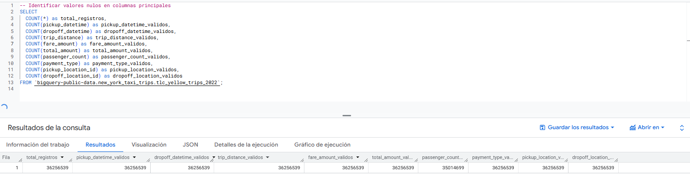
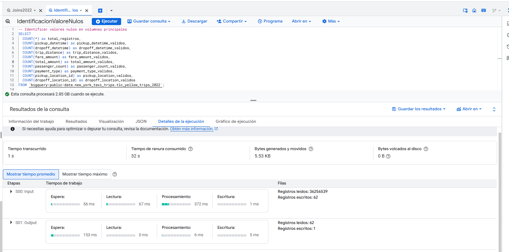

En los detalles de la ejecución de la consulta se pueden observar en la imagen anterior, donde se muestra que se procesaron 2.85 GB de datos y que los bytes generados fueron 5.53 KB con un tiempo transcurrido de 1s y tiempo de ranura consumido de 32s estos desde la data publica sin optimizaciones, ademas se muestra las etapas de la consulta.

2. **Metrica de Datos**: Se calcularon métricas clave como la distancia promedio, duración, tarifas y propinas de taxis en Nueva York durante el año 2022 sin optimizar.

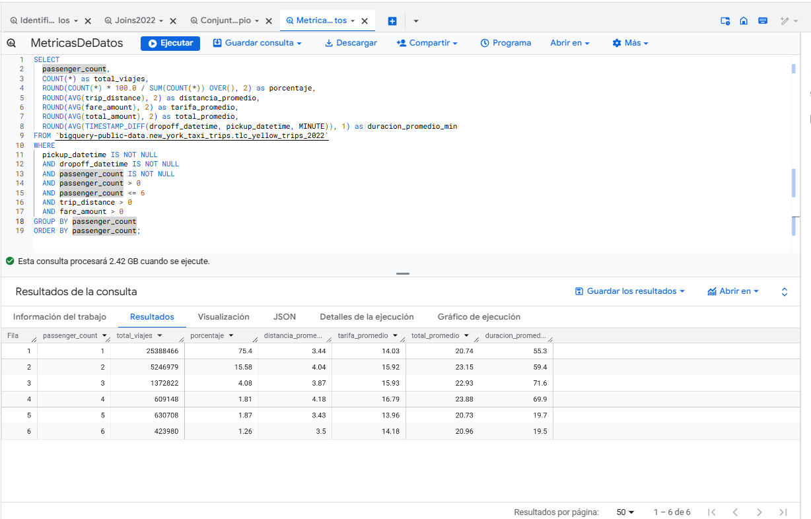

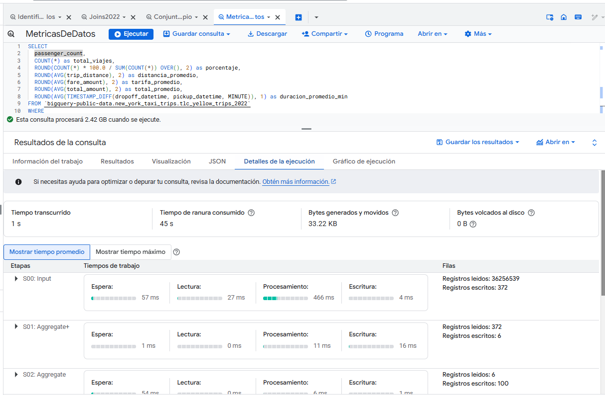

En los detalles de las métricas sin optimizar se puede observer que la ejecucion fue de 1s el tiempo de ranura consumido fue de 45s y los bytes generados fueron de 33.22 KB.

3. **Analisis de Distribucion de variables categoricas**: Se analizaron variables categoricas como el método de pago y por la contidad de pasajeros.

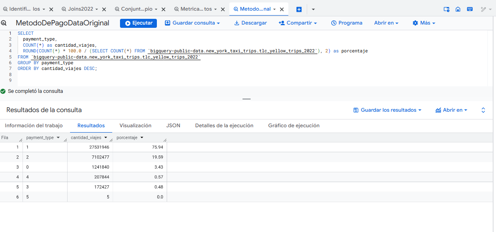
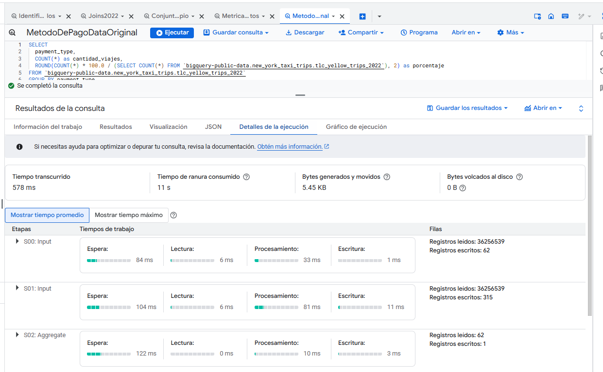

En los detalles de la distribucion de variables categoricas sin optimizar se puede observer que la ejecucion fue de 578 ms el tiempo de ranura consumido fue de 11 s y los bytes generados fueron de 5.45 KB.

ademas se analizo la cantidad de pasajeros en los viajes y los detalles de la consulta fueron las siguientes.
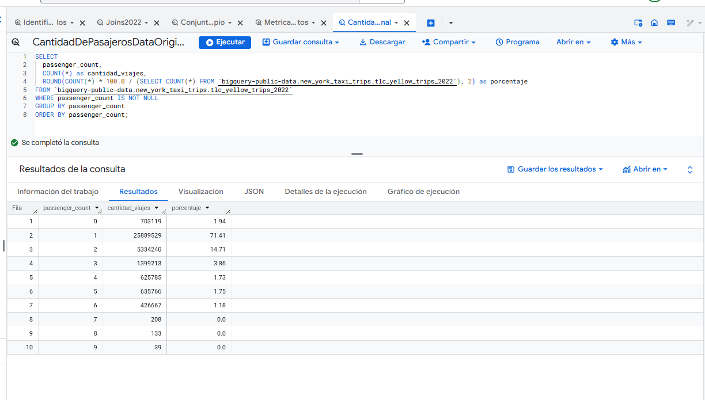
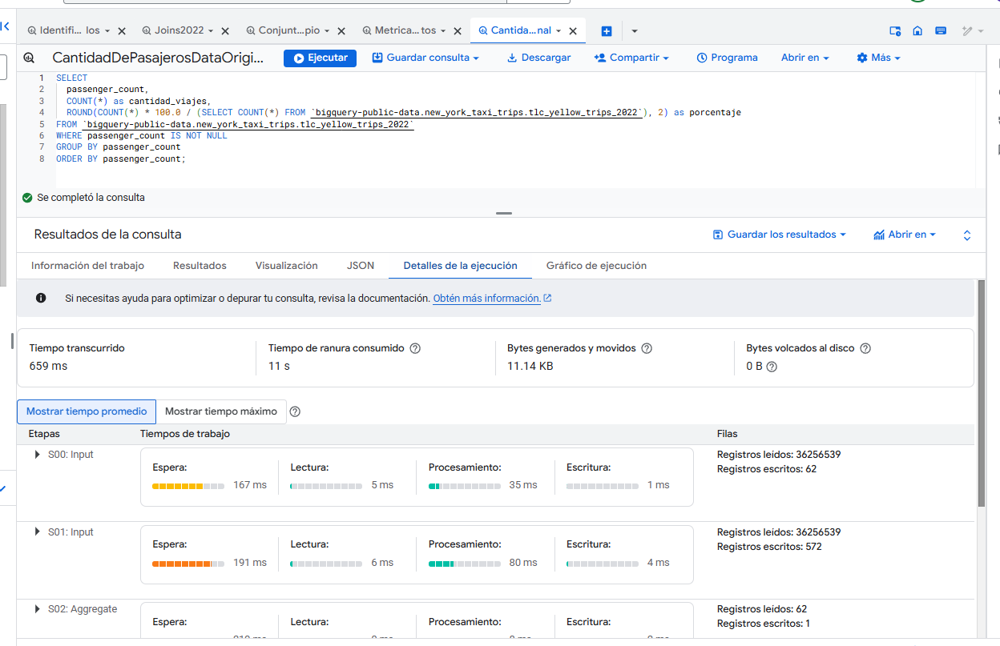

En los detalles de la cantidad de pasajeros sin optimizar se puede observer que la ejecucion fue de 659 ms el tiempo de ranura consumido fue de 11 s y los bytes generados fueron de 11.14 KB.

Estos análisis iniciales proporcionan una visión general de los datos y ayudan a identificar patrones y tendencias en el uso de taxis en Nueva York durante el año 2022 utilizando las informacion publica.

## Tablas Derivadas
Se crearon las siguientes tablas derivadas para optimizar las consultas y mejorar el rendimiento:

1. **Tabla para un conjunto de datos propio**: Se creó una tabla que contiene solo los registros de la tabla `bigquery-public-data.new_york_taxi_trips.tlc_yellow_trips_2022`. pero con un limite de 1,000,000 de registros para optimizar las consultas y mejorar el rendimiento.

```sql

CREATE OR REPLACE TABLE `MyDataSet.NRegistro`
PARTITION BY RANGE_BUCKET(data_file_month, GENERATE_ARRAY(1,12))
CLUSTER BY pickup_location_id, dropoff_location_id AS
SELECT * FROM `bigquery-public-data.new_york_taxi_trips.tlc_yellow_trips_2022` 
LIMIT 1000000;
```

2. **Tabla con JOINS con el data set taxi_zone**: Se creó una tabla que contiene los registros de la tabla `bigquery-public-data.new_york_taxi_trips.tlc_yellow_trips_2022` y se le hizo un JOIN con la tabla `bigquery-public-data.new_york_taxi_trips.taxi_zone_geom` para obtener información adicional sobre las zonas de recogida y destino, limitada a 1,000,000 de registros.

```sql
CREATE OR REPLACE TABLE
MyDataSet.joins AS
SELECT
  t.vendor_id,
  t.pickup_datetime,
  t.dropoff_datetime,
  t.passenger_count,
  t.trip_distance,
  t.payment_type,
  t.total_amount,
  p.zone_name AS pickup_zone,
  p.borough AS pickup_borough,
  d.zone_name AS dropoff_zone,
  d.borough AS dropoff_borough
FROM
  `bigquery-public-data.new_york_taxi_trips.tlc_yellow_trips_2022` t
LEFT JOIN
  `bigquery-public-data.new_york_taxi_trips.taxi_zone_geom` p
  ON CAST(t.pickup_location_id AS INT64) = CAST(p.zone_id AS INT64)
LEFT JOIN
  `bigquery-public-data.new_york_taxi_trips.taxi_zone_geom` d
  ON CAST(t.dropoff_location_id AS INT64) = CAST(d.zone_id AS INT64)
LIMIT 1000000;
```

3. **Tabla particionada y clusterizada por fecha y ubicación**: Se creó una tabla que está particionada por la fecha de recogida y clusterizada por la ubicación de recogida y destino, esto para mejorar el rendimiento de las consultas.

```sql
-- Crear tabla optimizada simple
CREATE OR REPLACE TABLE `MyDataSet.taxi_optimized`
PARTITION BY DATE(pickup_datetime)
CLUSTER BY pickup_location_id, dropoff_location_id
AS
SELECT 
  pickup_datetime,
  dropoff_datetime,
  pickup_location_id,
  dropoff_location_id,
  passenger_count,
  trip_distance,
  fare_amount,
  tip_amount,
  total_amount,
  payment_type,
  
  -- Solo algunos campos calculados básicos
  DATE(pickup_datetime) as pickup_date,
  EXTRACT(MONTH FROM pickup_datetime) as pickup_month,
  EXTRACT(HOUR FROM pickup_datetime) as pickup_hour,
  EXTRACT(DAYOFWEEK FROM pickup_datetime) as pickup_dayofweek

FROM `bigquery-public-data.new_york_taxi_trips.tlc_yellow_trips_2022`
WHERE 
  pickup_datetime IS NOT NULL
  AND dropoff_datetime IS NOT NULL
  AND trip_distance > 0
  AND fare_amount > 0
  AND total_amount > 0
LIMIT 1000000;
```

Estas tablas derivadas permiten realizar consultas más rápidas y eficientes, ya que están optimizadas para el tipo de análisis que se desea realizar sobre los datos de los taxis en Nueva York.

## Consultas Realizadas con las Tablas Derivadas

1. **Métricas Clave con Tabla Propia**: Se calcularon métricas clave como la distancia promedio, duración, tarifas y propinas de taxis en Nueva York durante el año 2022 utilizando la tabla propia creada.

```sql
SELECT 
  -- Estadísticas de distancia
  ROUND(AVG(trip_distance), 2) as distancia_promedio_millas,
  ROUND(MIN(trip_distance), 2) as distancia_minima,
  ROUND(MAX(trip_distance), 2) as distancia_maxima,
  ROUND(STDDEV(trip_distance), 2) as distancia_desv_std,
  
  -- Estadísticas de tarifa
  ROUND(AVG(fare_amount), 2) as tarifa_promedio,
  ROUND(MIN(fare_amount), 2) as tarifa_minima,
  ROUND(MAX(fare_amount), 2) as tarifa_maxima,
  
  -- Estadísticas de total pagado
  ROUND(AVG(total_amount), 2) as total_promedio,
  ROUND(MIN(total_amount), 2) as total_minimo,
  ROUND(MAX(total_amount), 2) as total_maximo,
  
  -- Estadísticas de propina
  ROUND(AVG(tip_amount), 2) as propina_promedio,
  
  -- Estadísticas de pasajeros
  ROUND(AVG(passenger_count), 1) as pasajeros_promedio,
  MIN(passenger_count) as pasajeros_minimo,
  MAX(passenger_count) as pasajeros_maximo
FROM `MyDataSet.NRegistro`
WHERE 
  trip_distance > 0 
  AND fare_amount > 0 
  AND total_amount > 0;
```
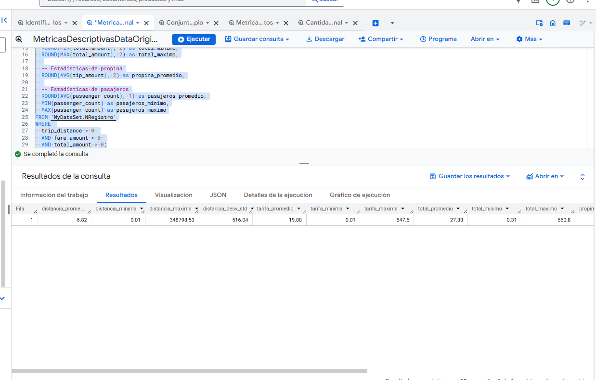
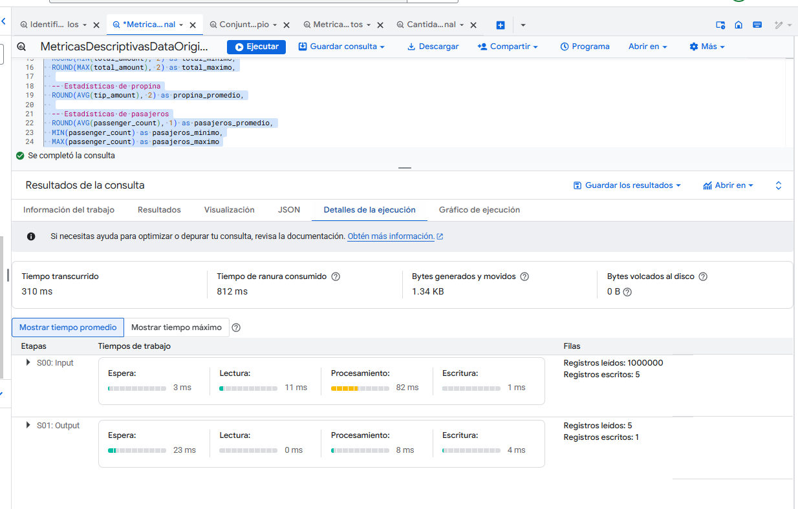

En los detalles de las métricas con la tabla propia se puede observer que la ejecucion fue de 310 ms el tiempo de ranura consumido fue de 812 ms y los bytes generados fueron de 1.34 KB.

2. **Análisis de Distribución de Variables Categóricas con Tabla Propia**: Se analizaron variables categóricas como el método de pago y la cantidad de pasajeros utilizando la tabla propia creada.

```sql
SELECT 
  payment_type,
  COUNT(*) as cantidad_viajes,
  ROUND(AVG(total_amount), 2) as total_promedio
FROM `MyDataSet.NRegistro`
GROUP BY payment_type
ORDER BY cantidad_viajes DESC;
```

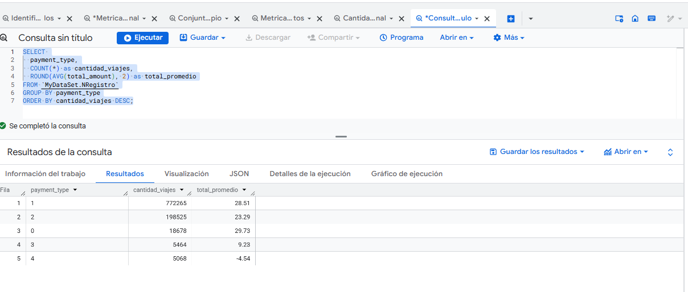
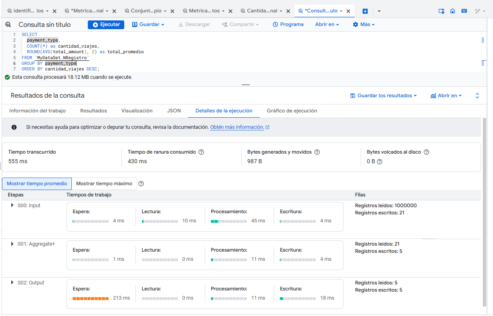

Los detalles de la distribucion de variables categoricas con la tabla propia se puede observer que la ejecucion fue de 555 ms el tiempo de ranura consumido fue de 430 ms y los bytes generados fueron de 987 B.

```sql
SELECT 
  passenger_count,
  COUNT(*) as cantidad_viajes,
  ROUND(AVG(total_amount), 2) as total_promedio
FROM `MyDataSet.NRegistro`
GROUP BY passenger_count
ORDER BY cantidad_viajes DESC;
```

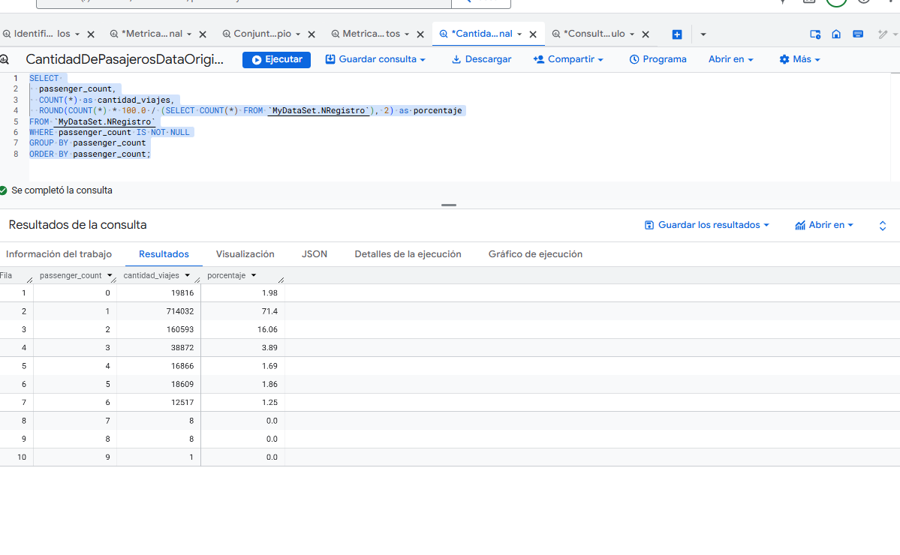
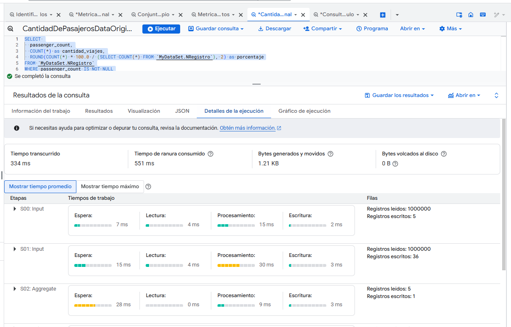

Los detalles de la cantidad de pasajeros con la tabla propia se puede observer que la ejecucion fue de 334 ms el tiempo de ranura consumido fue de 551 ms y los bytes generados fueron de 1.21 KB.

## Conclusiones del analisis de metricas y variables categoricas

1. **Métricas Clave**: Al utilizar la tabla propia creada, se observaron mejoras significativas en el rendimiento de las consultas para calcular métricas clave como la distancia promedio, duración, tarifas y propinas. El tiempo de ejecución se redujo considerablemente, lo que indica que la optimización de la tabla tuvo un impacto positivo en la eficiencia de las consultas.

2. **Variables Categóricas**: Al igual que en las consultas sin optimizar, se analizaron las mismas variables categóricas pero utilizando la tabla propia creada, lo que resultó en una mejora significativa en el rendimiento de las consultas.

3. **Eficiencia y Rendimiento**: La creación de tablas derivadas optimizadas, como la tabla propia, demostró ser una estrategia efectiva para mejorar la eficiencia y el rendimiento de las consultas en BigQuery. La reducción en el tiempo de ejecución y el consumo de recursos es crucial cuando se trabaja con grandes volúmenes de datos.


## Clusterización y particionamiento
Para optimizar aún más las consultas y mejorar el rendimiento, se implementaron técnicas de particionamiento y clusterización en las tablas derivadas creadas.

```sql
CREATE OR REPLACE TABLE `MyDataSet.taxi_optimized`
PARTITION BY DATE(pickup_datetime)
CLUSTER BY pickup_location_id, dropoff_location_id
AS
SELECT 
  pickup_datetime,
  dropoff_datetime,
  pickup_location_id,
  dropoff_location_id,
  passenger_count,
  trip_distance,
  fare_amount,
  tip_amount,
  total_amount,
  payment_type,
  
  DATE(pickup_datetime) as pickup_date,
  EXTRACT(MONTH FROM pickup_datetime) as pickup_month,
  EXTRACT(HOUR FROM pickup_datetime) as pickup_hour,
  EXTRACT(DAYOFWEEK FROM pickup_datetime) as pickup_dayofweek

FROM `bigquery-public-data.new_york_taxi_trips.tlc_yellow_trips_2022`
WHERE 
  pickup_datetime IS NOT NULL
  AND dropoff_datetime IS NOT NULL
  AND trip_distance > 0
  AND fare_amount > 0
  AND total_amount > 0
LIMIT 1000000;
```

1. **Particionamiento por Fecha**: La tabla `MyDataSet.taxi_optimized` fue particionada por la fecha de recogida (`pickup_datetime`). Esto permite que las consultas que filtran por rangos de fechas sean más eficientes, ya que solo se escanean las particiones relevantes en lugar de toda la tabla.

2. **Clusterización por Ubicación**: La misma tabla fue clusterizada por las columnas `pickup_location_id` y `dropoff_location_id`. La clusterización organiza los datos físicamente en el almacenamiento basado en los valores de estas columnas, lo que mejora el rendimiento de las consultas que filtran o agrupan por estas ubicaciones.

Estas técnicas de particionamiento y clusterización son fundamentales para manejar grandes volúmenes de datos en BigQuery, ya que reducen el tiempo de consulta y el consumo de recursos, lo que resulta en un análisis más rápido y eficiente de los datos de taxis en Nueva York durante el año 2022.

## Consultas con tablas clusterizadas y particionadas

1. **Viajes por Mes y Zona con Tabla Clusterizada y Particionada**: Se analizaron los viajes realizados por mes y zona utilizando la tabla clusterizada y particionada creada.

```sql
SELECT 
  pickup_month as mes,
  COUNT(*) as total_viajes,
  ROUND(AVG(fare_amount), 2) as tarifa_promedio,
  ROUND(SUM(total_amount), 0) as ingresos_totales
FROM `MyDataSet.taxi_optimized`
GROUP BY pickup_month
ORDER BY pickup_month;
```

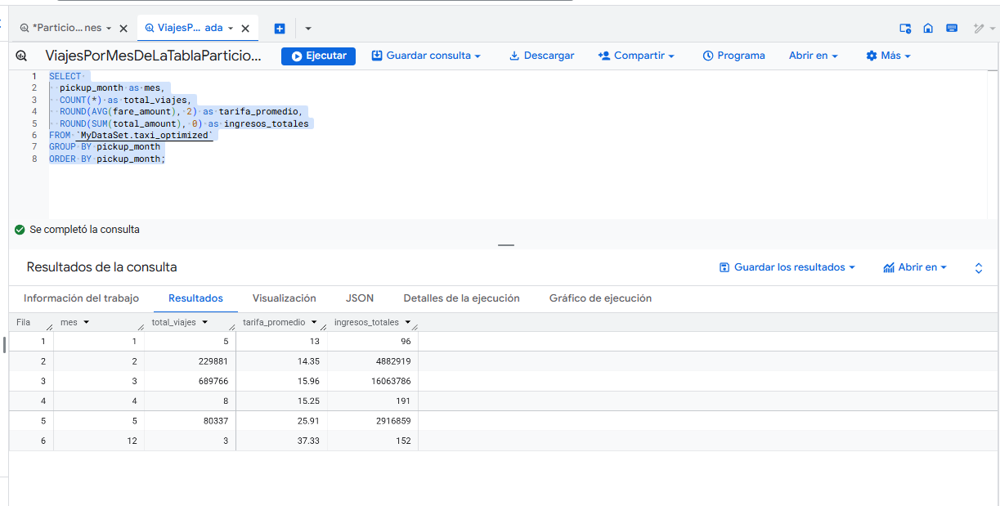
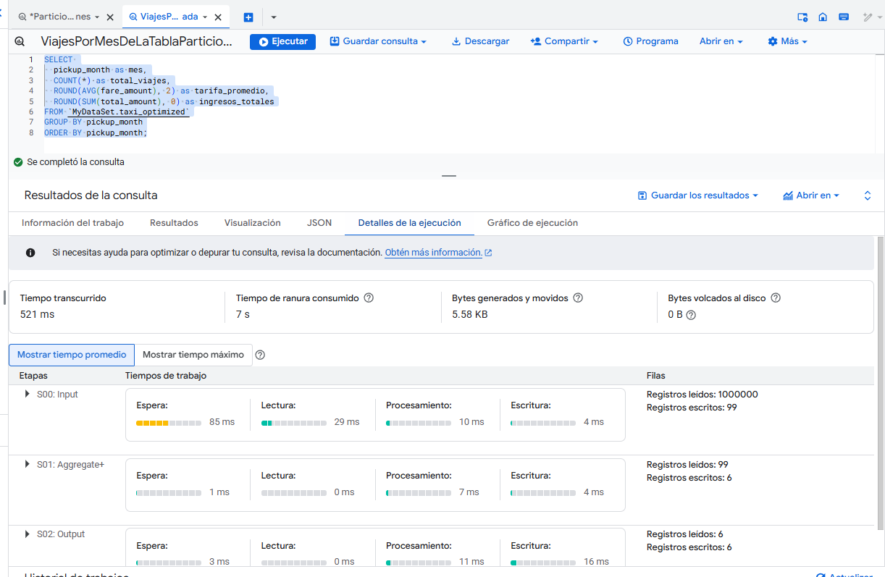

En los detalles de los viajes por mes con la tabla clusterizada y particionada se puede observer que la ejecucion fue de 521 ms el tiempo de ranura consumido fue de 7 s y los bytes generados fueron de 5.58 KB.

## JOINS con tablas derivadas
Se realizaron consultas que involucraron JOINS entre la tabla taxi_zone_geom y la tabla tlc_yellow_trips_2022 para obtener información adicional sobre las zonas de recogida y destino de los viajes en taxi.

```sql
CREATE OR REPLACE TABLE
MyDataSet.joins AS
SELECT
  t.vendor_id,
  t.pickup_datetime,
  t.dropoff_datetime,
  t.passenger_count,
  t.trip_distance,
  t.payment_type,
  t.total_amount,
  p.zone_name AS pickup_zone,
  p.borough AS pickup_borough,
  d.zone_name AS dropoff_zone,
  d.borough AS dropoff_borough
FROM
  `bigquery-public-data.new_york_taxi_trips.tlc_yellow_trips_2022` t
LEFT JOIN
  `bigquery-public-data.new_york_taxi_trips.taxi_zone_geom` p
  ON CAST(t.pickup_location_id AS INT64) = CAST(p.zone_id AS INT64)
LEFT JOIN
  `bigquery-public-data.new_york_taxi_trips.taxi_zone_geom` d
  ON CAST(t.dropoff_location_id AS INT64) = CAST(d.zone_id AS INT64)
LIMIT 1000000;
```
Esta tabla `MyDataSet.joins` contiene información combinada de los viajes en taxi junto con los nombres y distritos de las zonas de recogida y destino, lo que permite un análisis más detallado de los patrones de viaje en la ciudad de Nueva York.

Con esta tabla derivada creada, se realizaron consultas y se crearon tablas especificas para analizar los datos de manera más eficiente y visualizar los resultados en gráficos para su posterior análisis, como por ejemplo los viajes por zona, promedio de distancia recorrida por zona, densidad de demanda por borough y top mejores zonas con mejores rendimientos(analisis de KPIs).

1. **Top Mejores Zonas**: Se identificaron las 15 zonas con mejor rendimiento en términos de viajes, ingresos, ticket promedio, market share, distancia promedio, ocupación promedio, revenue por milla y porcentaje de pagos electrónicos utilizando la tabla derivada creada con JOINS.

```sql
CREATE OR REPLACE TABLE `MyDataSet.top_zonas` AS
SELECT 
  pickup_zone as zona_top,
  pickup_borough as distrito,
  COUNT(*) as viajes_zona,
  ROUND(SUM(total_amount), 0) as ingresos_zona_usd,
  ROUND(AVG(total_amount), 2) as ticket_promedio_zona,
  ROUND(COUNT(*) * 100.0 / (SELECT COUNT(*) FROM `MyDataSet.joins` WHERE pickup_zone IS NOT NULL), 2) as market_share_zona,
  ROUND(AVG(trip_distance), 2) as distancia_promedio_millas,
  ROUND(AVG(passenger_count), 1) as ocupacion_promedio_zona,
  ROUND(SUM(total_amount) / SUM(trip_distance), 2) as revenue_por_milla,
  COUNT(CASE WHEN payment_type = '1' THEN 1 END) as pagos_tarjeta,
  ROUND(COUNT(CASE WHEN payment_type = '1' THEN 1 END) * 100.0 / COUNT(*), 1) as porcentaje_pagos_electronicos
FROM `MyDataSet.joins`
WHERE pickup_zone IS NOT NULL 
  AND total_amount > 0
  AND trip_distance > 0
GROUP BY pickup_zone, pickup_borough
ORDER BY viajes_zona DESC
LIMIT 15;
```

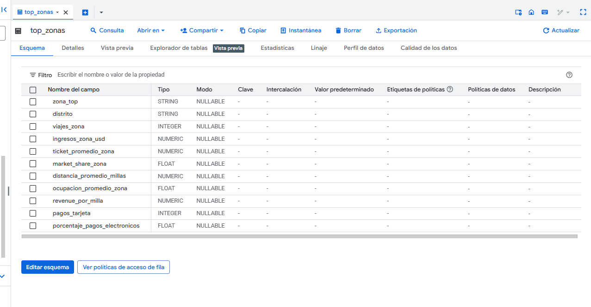
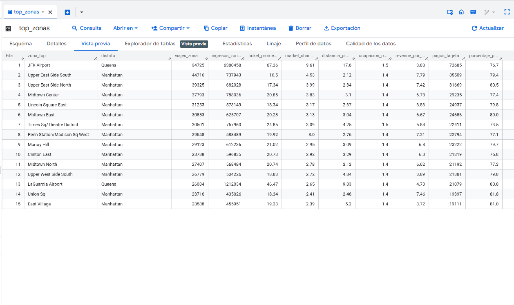


2. **Promedio de Distancia Recorrida por Zona**: Se calculó el promedio de distancia recorrida, ocupación promedio, ingresos totales y total de viajes por zona de recogida utilizando la tabla derivada creada con JOINS.

```sql
CREATE OR REPLACE TABLE `MyDataSet.AVGDistance` AS
SELECT
  pickup_zone AS zona_recogida,
  pickup_borough AS distrito_recogida,
  ROUND(AVG(trip_distance), 2) AS distancia_promedio_millas,
  ROUND(AVG(passenger_count), 1) AS ocupacion_promedio,
  SUM(total_amount) AS ingresos_totales,
  COUNT(*) AS total_viajes
FROM
  MyDataSet.joins
GROUP BY
  pickup_zone, pickup_borough
ORDER BY
  distancia_promedio_millas DESC
LIMIT 10;
```
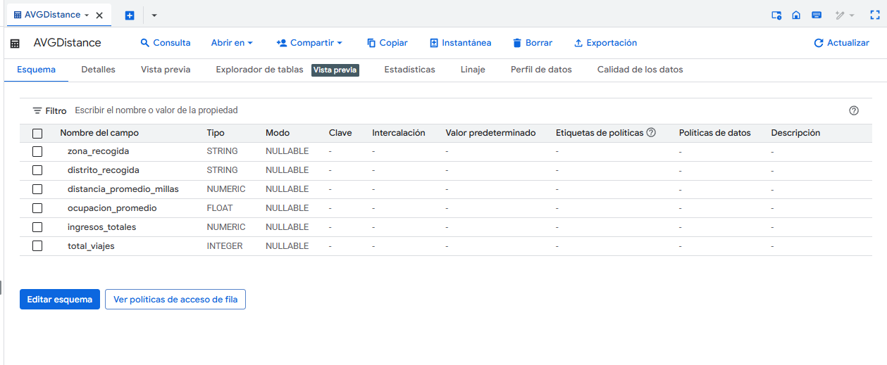
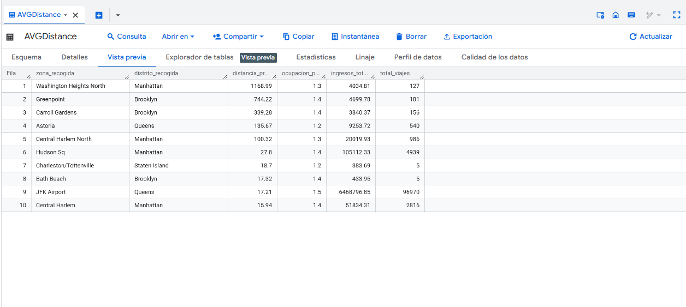


3. **Densidad de Demanda por Borough**: Se analizó la densidad de demanda por borough, incluyendo el total de viajes, ticket promedio, ingresos totales, zonas activas, distancia promedio y ocupación promedio utilizando la tabla derivada creada con JOINS.

```sql
CREATE OR REPLACE TABLE `MyDataSet.borough` AS
SELECT 
  pickup_borough as borough,
  COUNT(*) as total_viajes,                                    
  ROUND(AVG(total_amount), 2) as ticket_promedio,             
  ROUND(SUM(total_amount), 0) as ingresos_totales,            
  COUNT(DISTINCT pickup_zone) as zonas_activas,               
  ROUND(AVG(trip_distance), 2) as distancia_promedio,         
  ROUND(AVG(passenger_count), 1) as ocupacion_promedio,       
FROM `MyDataSet.joins`
WHERE pickup_borough IS NOT NULL 
  AND total_amount > 0
  AND trip_distance > 0
GROUP BY pickup_borough;
```
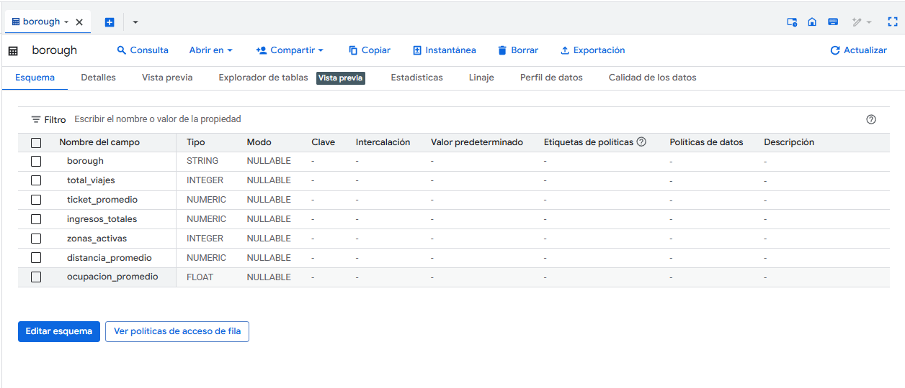
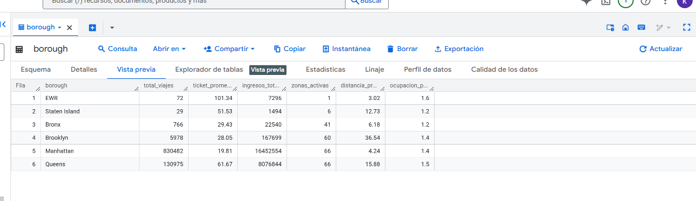

---

## Gráficas

[Enlace al DashboardRepresentativos](https://lookerstudio.google.com/s/unDt8PJK-nI)

### Top Mejores Zonas con Mejores Rendimientos

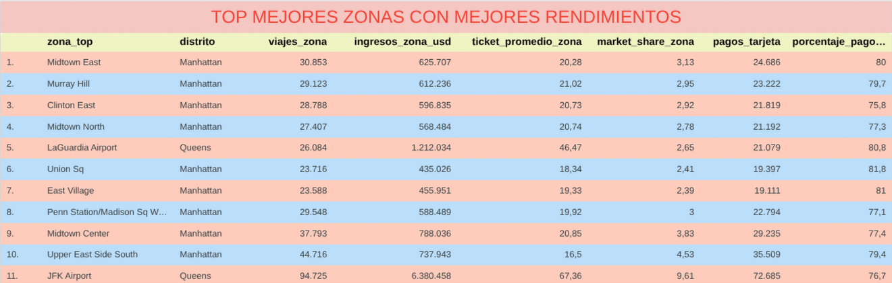

**1. Propósito de la Tabla**

El objetivo de esta tabla es identificar las zonas de la ciudad de Nueva York que son más importantes para el negocio de los taxis. No solo miramos la cantidad de viajes, sino que cruzamos varias métricas de rendimiento como los ingresos totales, el valor promedio de cada viaje y el comportamiento de pago del usuario. Esto nos da una visión completa de dónde se genera más valor.

**2. Desglose de las Métricas**

Para lograr este análisis, se defineiros las siguientes métricas clave:
* **Viajes Zona:** Es el número total de viajes que se originaron en esa zona. Mide la popularidad o el volumen de demanda.
* **Ingresos Zona (USD):** Es la suma de todo el dinero generado por los viajes desde esa zona. Mide el impacto económico directo.
* **Ticket Promedio Zona:** Se calcula dividiendo los ingresos totales entre el número de viajes. Esta métrica es muy importante porque nos dice el valor promedio de un viaje en esa área. Un ticket promedio alto es muy rentable.
* **Market Share Zona:** Representa el porcentaje de todos los viajes de la ciudad que pertenecen a esa zona. Nos ayuda a entender qué tan dominante es cada área en el mercado total.
* **Pagos Tarjeta y Porcentaje:** Muestra la preferencia de los usuarios por pagar con tarjeta. [cite_start]Esto es relevante para entender el comportamiento del consumidor y la digitalización de los pagos[cite: 53].

**3.Hallazgos y Patrones Relevantes**

Al realizar el análisis de los datos, se encontraron varios patrones:
* **Los Aeropuertos son los líderes indiscutibles en ingresos:** JFK y LaGuardia, aunque no tienen el mayor número de viajes comparado con algunas zonas de Manhattan, generan los ingresos y el ticket promedio más altos por un amplio margen. El viaje desde o hacia un aeropuerto es el más valioso para un taxista. Por ejemplo, el ticket promedio en JFK es de $67, mientras que en zonas de Manhattan ronda los $20.
* **Manhattan es el corazón del negocio diario:** Zonas como Midtown (East, North, Center), Upper East Side y Union Square dominan la lista. Esto demuestra que el centro neurálgico de la actividad económica y social de la ciudad es donde se concentra el volumen diario de viajes de taxi.
* **Diferentes tipos de "zonas top":**
    * **Por Volumen:** JFK Airport, Upper East Side South y Midtown Center son las zonas con mayor cantidad de viajes.
    * **Por Rentabilidad (Ticket Promedio):** JFK y LaGuardia son, por mucho, las más rentables por viaje.
    * **Por Comportamiento de Pago:** En zonas como Union Sq y East Village se ve el mayor porcentaje de uso de tarjeta (más del 81%). Esto podría indicar una población más joven o una mayor cantidad de transacciones relacionadas con el ocio.


### Densidad de Demanda por Borough

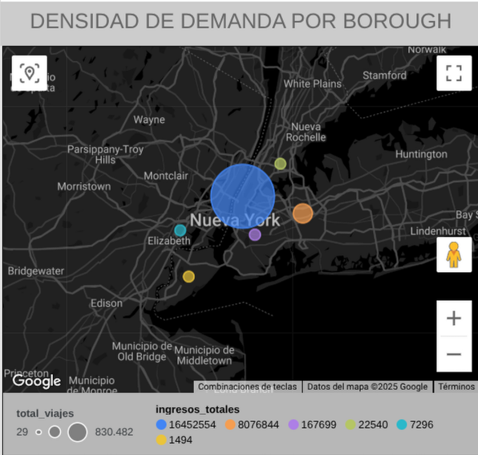

**1. Propósito del Mapa**

Después de analizar las zonas más rentables en una tabla, quisimos visualizar esta información geográficamente para entender la distribución espacial de la demanda. Este mapa de calor o de burbujas nos permite responder a la pregunta:¿Dónde se concentra la actividad de los taxis en Nueva York?.

**2. Cómo Interpretar la Visualización**

Este mapa utiliza dos elementos visuales para comunicar la información de manera efectiva:
* **El tamaño de la burbuja:** Representa el **volumen total de viajes** que se originan en esa área. Una burbuja más grande significa una mayor cantidad de viajes y, por lo tanto, una mayor demanda.
* **El color de la burbuja:** Representa los **ingresos totales** generados en esa zona. Cada color está asociado a un rango de ingresos, lo que nos permite identificar rápidamente las áreas más lucrativas.

**3. Hallazgos y Patrones Clave**

La visualización revela patrones geográficos muy claros y confirma los hallazgos de nuestra tabla anterior:
* **Manhattan es el epicentro absoluto de la demanda:** "La burbuja más grande, ubicada sobre Manhattan, demuestra que la inmensa mayoría de los viajes de taxi se originan en este distrito. Es el corazón indiscutible del negocio en términos de volumen".
* **Queens destaca como un centro de altos ingresos:** Observamos una burbuja de color naranja sobre Queens. Aunque es más pequeña en tamaño que la de Manhattan (lo que indica menos viajes en total), su color representa el segundo nivel más alto de ingresos. Esto se alinea perfectamente con nuestro análisis anterior que identificó a los aeropuertos JFK y LaGuardia, ubicados en Queens, como las zonas con el ticket promedio más alto y una facturación masiva.
* **Actividad significativamente menor en otros distritos:** Las burbujas sobre los otros distritos, como Brooklyn, El Bronx y Staten Island, son considerablemente más pequeñas y de colores que indican menores ingresos. Esto demuestra que, si bien hay servicio en toda la ciudad, la actividad está fuertemente concentrada en Manhattan y en los puntos estratégicos de Queens.


### Promedio Distancia Recorrida por Zona

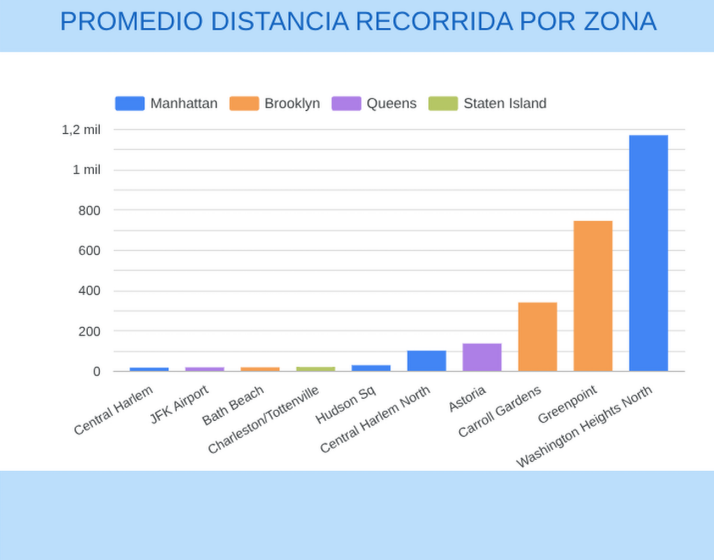

**1. Propósito de la Gráfica**

Mientras que los mapas y las tablas anteriores nos mostraron *dónde* está la demanda y *cuánto* dinero se genera, esta gráfica busca responder una pregunta diferente: **¿Qué tan largos son los viajes típicos que se inician en diferentes zonas de la ciudad?** El objetivo es entender los patrones de movilidad, diferenciando entre zonas de viajes cortos y locales y zonas de viajes más largos o de tipo 'commuter'.

**2. Cómo Interpretar la Gráfica**

En este gráfico de barras, el eje vertical (eje Y) representa la distancia promedio de un viaje en millas, mientras que el eje horizontal (eje X) lista las diferentes zonas de origen. Hemos coloreado las barras según el distrito (`Borough`) al que pertenecen, lo que nos permite comparar no solo entre zonas, sino también entre distritos.

**3. Hallazgos y Patrones Clave**

* **Viajes Largos desde Zonas Periféricas o 'Puente'**: Observamos que las distancias promedio más largas provienen de zonas como **Washington Heights North** (en el extremo norte de Manhattan) y **Greenpoint** (Brooklyn). Esto sugiere que estas áreas pueden funcionar como puntos de partida para viajes más largos, posiblemente hacia el centro de negocios de Manhattan o incluso hacia otros distritos.
* **Viajes Cortos en Zonas Céntricas o de Alta Densidad**: Por el contrario, muchas zonas, especialmente en Manhattan como Central Harlem o Hudson Sq, muestran distancias promedio muy cortas. Esto es característico de áreas con alta densidad de puntos de interés, donde los taxis se usan para trayectos breves que serían demasiado largos para caminar.
* **El Hallazgo Contraintuitivo de JFK Airport**: Un resultado que llama mucho la atención es la distancia promedio extremadamente corta para viajes que inician en el **aeropuerto JFK**. Esto contrasta fuertemente con nuestro hallazgo anterior de que es la zona con el ticket promedio más alto. Una posible explicación es que el dataset incluye un gran volumen de viajes muy cortos *dentro* del perímetro del aeropuerto (ej. entre terminales, a estacionamientos o a hoteles cercanos), lo que reduce drásticamente el promedio general. Este es un ejemplo perfecto de cómo el análisis exploratorio nos ayuda a descubrir complejidades en los datos que merecen una investigación más profunda.
