# Documentacion - Modelado Predictivo con BigQuery ML

## Información del Proyecto

- Nombre del Proyecto: Predicción de Propinas en NYC Taxi usando Machine Learning
- Curso: Seminario de Sistemas 2
- Universidad: Universidad de San Carlos de Guatemala
- Facultad: Ingeniería - Ingeniería en Ciencias y Sistemas

### Equipo de Trabajo

- Integrante 1: Mario Ernesto Marroquin - 202110509
- Integrante 2: Kewin Maslovy Patzan - 202103206

### Objetivo del Modelado

Construir y evaluar modelos predictivos de Machine Learning en BigQuery ML para predecir el monto de propina (tip_amount) que recibirá un taxista en base a características del viaje, permitiendo a los conductores optimizar sus decisiones operativas y a la empresa mejorar estimaciones de ingresos.

### Dataset y Variables Utilizadas(Preparación de Datos)

``` sql
CREATE OR REPLACE TABLE `MyDataSet.ML_dataset_clean` AS
SELECT 
  -- Variable objetivo
  tip_amount,
  
  -- Features numéricas
  trip_distance,
  fare_amount,
  passenger_count,
  
  -- Features temporales
  pickup_hour,
  pickup_dayofweek,
  pickup_month,
  
  -- Features categóricas (como strings para BigQuery ML)
  CAST(pickup_location_id AS STRING) as pickup_location_id,
  CAST(dropoff_location_id AS STRING) as dropoff_location_id,
  payment_type,
  
  -- Features derivadas
  CASE 
    WHEN pickup_dayofweek IN (1, 7) THEN 'weekend'
    ELSE 'weekday'
  END as day_type,
  
  CASE 
    WHEN pickup_hour BETWEEN 6 AND 9 THEN 'morning_rush'
    WHEN pickup_hour BETWEEN 17 AND 20 THEN 'evening_rush'
    WHEN pickup_hour BETWEEN 0 AND 5 THEN 'late_night'
    ELSE 'regular'
  END as time_period,
  
  -- Ratio propina/tarifa (para análisis, no para modelo)
  ROUND(tip_amount / NULLIF(fare_amount, 0), 3) as tip_ratio,
  
  -- Fecha para división temporal
  pickup_date

FROM `MyDataSet.taxi_optimized`
WHERE 
  -- Filtros de calidad
  payment_type = '1'  -- Solo pagos con tarjeta (propinas registradas)
  AND tip_amount >= 0  -- Propinas válidas
  AND tip_amount <= 50  -- Filtrar valores extremos
  AND fare_amount > 0
  AND fare_amount <= 200  -- Filtrar tarifas extremas
  AND trip_distance > 0
  AND trip_distance <= 50
  AND passenger_count BETWEEN 1 AND 6
  AND pickup_hour IS NOT NULL
  AND pickup_dayofweek IS NOT NULL
  AND pickup_location_id IS NOT NULL
  AND dropoff_location_id IS NOT NULL;
```

#### Fuente de Datos:

- Dataset Base: Tabla optimizada de Fase 1 MyDataSet.taxi_optimized
- Registros Totales: 10 millones de viajes
- Período: Año 2022
- Filtros Aplicados: Solo pagos con tarjeta (payment_type = '1') donde se registran propinas


#### Variable Objetivo (Target):

- tip_amount - Monto de propina en dólares (USD)
- Tipo: Continua (Regresión)
- Rango válido: $0 - $50

### Features (Variables Independientes):

#### Variables Numéricas:

- fare_amount - Tarifa base del viaje
- trip_distance - Distancia del viaje en millas
- passenger_count - Número de pasajeros
- pickup_hour - Hora de recogida (0-23)
- pickup_dayofweek - Día de la semana (1-7)
- pickup_month - Mes del año (1-12)

#### Variables Categóricas:

- pickup_location_id - ID de zona de origen
- dropoff_location_id - ID de zona de destino
- day_type - Tipo de día (weekday/weekend)
- time_period - Período del día (morning_rush/evening_rush/regular/late_night)


### División del Dataset:

``` sql
-- CONJUNTO DE ENTRENAMIENTO (80% - primeros meses)
CREATE OR REPLACE TABLE `MyDataSet.ML_train_data` AS
SELECT *
FROM `MyDataSet.ML_dataset_clean`
WHERE pickup_date < '2022-10-01';  -- Enero a Septiembre (80%)

-- CONJUNTO DE PRUEBA (20% - últimos meses)
CREATE OR REPLACE TABLE `MyDataSet.ML_test_data` AS
SELECT *
FROM `MyDataSet.ML_dataset_clean`
WHERE pickup_date >= '2022-10-01';  -- Octubre a Diciembre (20%)
```

| Conjunto | Período | Registros | Porcentaje | Uso |
|----------|---------|-----------|------------|-----|
| Entrenamiento | Enero - Septiembre 2022 | 6,037,685 | 80% | Entrenar modelos |
| Prueba | Octubre - Diciembre 2022 | 1,596,183 | 20% | Evaluar modelos |


### Modelos Implementados

#### Modelo 1: Regresión Lineal

#### Especificaciones:
- model_type: LINEAR_REG
- input_label_cols: ['tip_amount']
- enable_global_explain: TRUE


#### Características:

- Asume relación lineal entre features y target
- Interpretación simple y directa
- Baseline para comparación
- Rápido de entrenar

#### Justificación:

Modelo base para establecer una línea de comparación. Su simplicidad permite entender rápidamente qué variables tienen mayor peso lineal en la predicción de propinas.


#### Modelo 2: Boosted Tree Regressor

#### Especificaciones:

- model_type: BOOSTED_TREE_REGRESSOR
- input_label_cols: ['tip_amount']
- max_iterations: 50
- max_tree_depth: 6
- learning_rate: 0.1
- subsample: 0.8
- l2_reg: 0.1

#### Hiperparámetros:

- max_iterations (50): Número de árboles en el ensemble
- max_tree_depth (6): Profundidad máxima por árbol (evita overfitting)
- learning_rate (0.1): Tasa de aprendizaje conservadora
- subsample (0.8): 80% de datos por árbol (reduce overfitting)
- l2_reg (0.1): Regularización L2 para generalización

#### Características:

- Captura relaciones no lineales
- Maneja interacciones entre variables automáticamente
- Robusto ante outliers
- Mayor capacidad predictiva

#### Justificación:

Modelo avanzado que puede capturar patrones complejos en el comportamiento de propinas, como interacciones entre hora del día, ubicación y tarifa.

### Métricas de Evaluación

- MAE (Mean Absolute Error)
- RMSE (Root Mean Squared Error)
- R² (Coeficiente de Determinación)
- Median AE

### Interpretación de Métricas:

- MAE: Error promedio en dólares. Un MAE de $1.50 significa que en promedio nos equivocamos $1.50.
- RMSE: Penaliza más los errores grandes. Útil para detectar predicciones muy alejadas.
- R² Score: Porcentaje de varianza explicada. R² = 0.75 significa que el modelo explica el 75% de la variación en propinas.
- Median AE: Mediana del error absoluto, menos sensible a outliers.


### Modelos en BigQuery ML

#### Análisis 1: Creación del Modelo Base (Regresión Lineal)

En este primer paso, creamos nuestro modelo. Elegimos una Regresión Lineal por ser un modelo simple, rápido de entrenar e interpretable, lo que nos permitirá tener una primera idea de qué variables son importantes.

#### Consulta para Modelo de Regresión Lineal con Dataset de Entrenamiento

``` sql
CREATE OR REPLACE MODEL `MyDataSet.tip_prediction_linear`
OPTIONS(
  model_type='LINEAR_REG',
  input_label_cols=['tip_amount'],
  enable_global_explain=TRUE,
  data_split_method='NO_SPLIT' 
) AS
SELECT 
  -- Variable objetivo
  tip_amount,
  
  -- Features numéricas
  fare_amount,
  trip_distance,
  passenger_count,
  pickup_hour,
  pickup_dayofweek,
  pickup_month,
  
  -- Features categóricas
  pickup_location_id,
  dropoff_location_id,
  day_type,
  time_period

FROM `MyDataSet.ML_train_data`;
```

#### Descripción de la Consulta

Esta consulta utiliza CREATE OR REPLACE MODEL para entrenar un nuevo modelo de Machine Learning en BigQuery.

- model_type='LINEAR_REG': Especifica que queremos entrenar un modelo de Regresión Lineal. El objetivo es predecir un valor numérico continuo, en este caso, la propina (tip_amount).

- input_label_cols=['tip_amount']: Le dice al modelo cuál es nuestra variable objetivo, es decir, la columna que queremos aprender a predecir.

- data_split_method='NO_SPLIT': Esta es una opción clave. Le indicamos al modelo que no divida automáticamente los datos en conjuntos de entrenamiento y evaluación. Hacemos esto porque nosotros ya hemos dividido manualmente nuestros datos en ML_train_data y ML_test_data.

- SELECT ... FROM ...: Esta parte de la consulta define los features o variables de entrada que el modelo usará para hacer sus predicciones. Usamos todas las columnas relevantes de nuestra tabla de entrenamiento.


#### Intervencion de resultados


#### Progreso y detalles del modelo

#### TRAINING_INFO para Modelo de Regresión Lineal por iteración

``` sql
SELECT *
FROM ML.TRAINING_INFO(MODEL `MyDataSet.tip_prediction_linear`)
ORDER BY iteration;
```

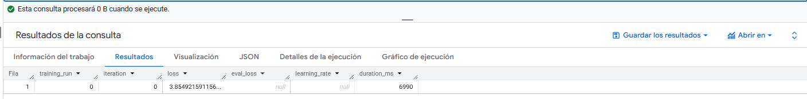

Esta consulta utiliza la función ML.TRAINING_INFO para obtener una tabla con los detalles de cada iteración del proceso de entrenamiento del modelo tip_prediction_linear.

- iteration = 0: Este es el dato más importante. Nos indica que el modelo no usó un método iterativo (como Descenso de Gradiente), sino que resolvió el problema usando la "ecuación normal". Esta es una solución matemática directa que encuentra los pesos óptimos en un solo paso. Por eso solo existe la iteración 0.

- loss = 3.85: Esta es la métrica de pérdida (error) del modelo sobre los datos de entrenamiento. Para regresión lineal, esto es el Error Cuadrático Medio (MSE). Un MSE de 3.85 significa que el promedio de los errores al cuadrado fue 3.85.

- eval_loss = null: Este valor es null (vacío) y es completamente esperado. Ocurre porque al crear el modelo especificamos data_split_method='NO_SPLIT'. Como no separamos un conjunto de evaluación durante el entrenamiento, no hay métrica de eval_loss para reportar.

- learning_rate = null: Es null por la misma razón que iteration es 0. El método de "ecuación normal" no requiere una tasa de aprendizaje, por lo que no se aplica.

#### ML.WEIGHTS para Modelo de Regresión Lineal 

``` sql
SELECT *
FROM ML.WEIGHTS(MODEL `MyDataSet.tip_prediction_linear`)
ORDER BY ABS(weight) DESC
LIMIT 10000;
```

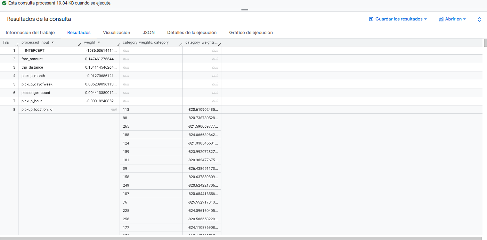

Después de entrenar el modelo, necesitamos entender cómo toma sus decisiones. Para un modelo de Regresión Lineal, esto se hace inspeccionando sus pesos (coeficientes). Un peso nos dice cuánto y en qué dirección (positiva o negativa) una variable afecta la predicción final de la propina.

#### Descripción de la Consulta

- ML.WEIGHTS(...): Esta es la función clave. Se usa específicamente con modelos lineales y logísticos para extraer los coeficientes (pesos) que el modelo aprendió para cada variable.

- ORDER BY ABS(weight) DESC: Este es el paso más importante para la interpretabilidad. Ordenamos los pesos por su valor absoluto de mayor a menor. Esto nos muestra qué variables tienen el mayor impacto en la predicción, independientemente de si el impacto es positivo (aumenta la propina) o negativo (la disminuye).

#### Interpretación de Resultados

- _INTERCEPT_ (Peso: -0.204): Este es el punto de partida o valor base de la predicción. Si todas las demás variables fueran cero, el modelo predeciría una propina de -$0.20.

- fare_amount (Peso: 0.147): Esta es la variable más importante según el modelo.

-- Interpretación: Por cada $1 adicional que cuesta el viaje (fare_amount), el modelo predice que la propina (tip_amount) aumentará en $0.147 (casi 15 centavos). Esto tiene mucho sentido: a viajes más caros, mayores propinas.

- trip_distance (Peso: 0.104): La segunda variable más importante.

-- Interpretación: Por cada milla adicional que dura el viaje, la propina aumenta en $0.104 (unos 10 centavos). Esto también es muy lógico y refuerza la idea de que el costo y la distancia son los principales impulsores de la propina.

- Otras variables numéricas (Peso: ~0): Variables como pickup_month, pickup_dayofweek, passenger_count y pickup_hour tienen pesos muy pequeños (ej: 0.005, -0.0001).

-- Interpretación: El modelo ha aprendido que estas variables apenas influyen en el monto de la propina. El día de la semana o el mes no son predictores significativos.

- Variables Categóricas (...location_id):

-- ¿Por qué el weight es null?: Porque BigQuery ML convierte automáticamente estas columnas en cientos de columnas "dummy", una por cada ID de ubicación.

-- Interpretación: Los pesos reales están en la columna category_weights. Vemos valores extremadamente grandes y negativos (ej: -822.38 para la zona de destino 106). Esto sugiere que ciertas ubicaciones (posiblemente aeropuertos o zonas con tarifas fijas) están fuertemente asociadas con propinas muy bajas o nulas, y el modelo aplica un gran ajuste negativo cuando ve esos IDs.

- Conclusión del Análisis: El modelo lineal base nos confirma que el costo (fare_amount) y la distancia (trip_distance) son, por mucho, los factores más decisivos para predecir la propina.

#### Evaluación del Modelo Lineal (Sobre Datos de Prueba)

``` sql
CREATE OR REPLACE TABLE `MyDataSet.model1_metrics` AS
SELECT 
  'Linear Regression' as model_name,
  'tip_prediction_linear' as model_id,
  mean_absolute_error,
  mean_squared_error,
  SQRT(mean_squared_error) as rmse,
  r2_score,
  median_absolute_error,
  CURRENT_TIMESTAMP() as evaluation_timestamp
FROM ML.EVALUATE(MODEL `MyDataSet.tip_prediction_linear`,
  (SELECT 
    tip_amount,
    fare_amount,
    trip_distance,
    passenger_count,
    pickup_hour,
    pickup_dayofweek,
    pickup_month,
    pickup_location_id,
    dropoff_location_id,
    day_type,
    time_period
  FROM `MyDataSet.ML_test_data`)
);
```

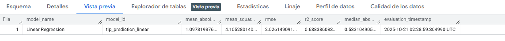

#### Descripción de la Consulta

Esta consulta evalúa el rendimiento de nuestro modelo lineal (tip_prediction_linear) usando la función ML.EVALUATE.

- ML.EVALUATE(...): Calcula un conjunto de métricas de rendimiento (como r2_score, mean_absolute_error, etc.) comparando las predicciones del modelo con los valores reales.

- FROM `MyDataSet.ML_test_data`: Este es el punto clave. Estamos pasando nuestros datos de prueba al modelo. Esta es la verdadera "prueba final" de su rendimiento.

- CREATE OR REPLACE TABLE ...: En lugar de solo mostrar las métricas en pantalla, las guardamos en una nueva tabla llamada model1_metrics. Esto es una excelente práctica, ya que nos permite almacenar los resultados y compararlos fácilmente con los de otros modelos que entrenemos más adelante.

- Campos Adicionales: Añadimos campos de metadatos como model_name, model_id y evaluation_timestamp para saber qué modelo produjo estas métricas y cuándo. También calculamos el rmse (Root Mean Squared Error) a partir del mean_squared_error porque es más fácil de interpretar.

#### Interpretación de Resultados

- r2_score = 0.688:

-- El Coeficiente de Determinación. Mide qué porcentaje de la variación en las propinas puede ser explicado por nuestro modelo.

-- Interpretación: Nuestro modelo explica el 68.8% de la variabilidad en las propinas. Este es un resultado sólido para un modelo base. Es muy similar a su puntuación en los datos de entrenamiento (0.675, de una consulta anterior), lo que es una excelente noticia. Significa que el modelo generaliza bien y no está sobreajustado (overfitting).

- mean_absolute_error (MAE) = 1.097:

-- El Error Absoluto Medio. Es la métrica más fácil de entender.

-- Interpretación: En promedio, las predicciones de propina de nuestro modelo se equivocan por $1.10 (hacia arriba o hacia abajo). Si la propina real fue de $3.00, el modelo pudo haber predicho $1.90 o $4.10.

- rmse (Root Mean Squared Error) = 2.026:

-- La raíz cuadrada del Error Cuadrático Medio. Es similar al MAE, pero penaliza más los errores grandes.

-- Interpretación: Al igual que el MAE, mide el error promedio en las mismas unidades (dólares). El hecho de que sea más alto que el MAE (2.02 vs 1.10) es normal e indica que el modelo tiene algunos errores de predicción que son significativamente grandes.

- median_absolute_error = 0.533:

-- La mediana de todos los errores de predicción.

-- Interpretación: El 50% de todas las predicciones del modelo tienen un error de $0.53 o menos. Esta es una métrica "robusta" (no se ve afectada por errores muy grandes) y nos dice que, para la mayoría de los viajes, el modelo es bastante preciso.

- Conclusión del Análisis: El modelo lineal base funciona decentemente. Explica casi el 70% de la propina y tiene un error promedio de $1.10. Este es nuestro punto de referencia (baseline) a vencer con modelos más avanzados.


#### Verificación del Modelo (Evaluación sobre Datos de prueba y una muestra de 1 millón de filas)

``` sql
SELECT *
FROM ML.EVALUATE(MODEL `MyDataSet.tip_prediction_linear`,
  (SELECT 
    tip_amount,
    fare_amount,
    trip_distance,
    passenger_count,
    pickup_hour,
    pickup_dayofweek,
    pickup_month,
    pickup_location_id,
    dropoff_location_id,
    day_type,
    time_period
  FROM `MyDataSet.ML_test_data`
  LIMIT 1000000)  -- Muestra para evaluación rápida
);
```

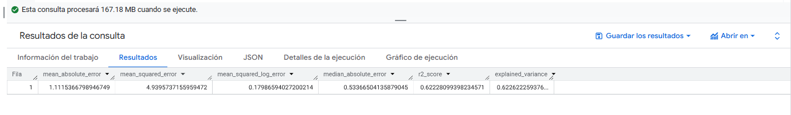

Realizamos una evaluación rápida del modelo lineal. En lugar de usar la tabla CREATE OR REPLACE TABLE (como en el Análisis 4) o de evaluar sobre el conjunto completo, aquí usamos SELECT * con un LIMIT de 1 millón de filas. Esto es útil para obtener una estimación rápida del rendimiento sin consumir tantos recursos.

#### Descripción de la Consulta

Esta consulta utiliza ML.EVALUATE para medir el rendimiento de nuestro modelo lineal sobre el conjunto de prueba (ML_test_data). La diferencia clave es el uso de LIMIT 1000000, que le pide a BigQuery que solo use la primera millón de filas del conjunto de prueba para la evaluación. Esto resulta en una consulta mucho más rápida y barata, ideal para verificaciones rápidas.

#### Interpretación de Resultados


- r2_score = 0.622:

-- En esta muestra, el modelo explica el 62.2% de la variabilidad de la propina. Este número es un poco más bajo que el 68.8% que obtuvimos al evaluar el conjunto de prueba completo.

- mean_absolute_error (MAE) = 1.115:

-- El error promedio en esta muestra es de $1.11, lo cual es muy similar al error de $1.10 del conjunto completo.

- median_absolute_error = 0.538:

-- La mediana del error es de $0.54. Esto significa que la mitad de las predicciones en esta muestra tuvieron un error de 54 centavos o menos, lo cual es un buen indicador de que el modelo es bastante preciso para la mayoría de los casos.

- Conclusión del Análisis: Los resultados de esta muestra son consistentes con los de la evaluación completa. Las ligeras diferencias (especialmente en r2_score) se deben a la varianza del muestreo: el millón de filas que tomamos no representa perfectamente al conjunto de prueba completo. Esto confirma que la evaluación del Análisis completo (sobre el conjunto de prueba completo) es la más confiable para reportar el rendimiento final del modelo.

#### Predicciones del Modelo Lineal

``` sql
SELECT 
  tip_amount as real_tip,
  predicted_tip_amount as predicted_tip,
  ROUND(ABS(tip_amount - predicted_tip_amount), 2) as error_absoluto,
  fare_amount,
  trip_distance,
  pickup_hour,
  day_type,
  time_period
FROM ML.PREDICT(MODEL `MyDataSet.tip_prediction_linear`,
  (SELECT * FROM `MyDataSet.ML_test_data` LIMIT 1000000)
)
ORDER BY error_absoluto DESC;
```

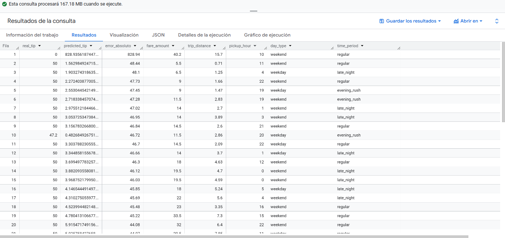

#### Descripción de la Consulta

- ML.PREDICT(MODEL `MyDataSet.tip_prediction_linear`...)`: Usamos la función de predicción en nuestro modelo lineal base.

- FROM `MyDataSet.ML_test_data` LIMIT 1000000`: Le pasamos una muestra de 1 millón de filas de nuestros datos de prueba.

- ORDER BY error_absoluto DESC: Ordenamos los resultados por el error más grande para que los peores fallos del modelo aparezcan primero.

#### Interpretación de Resultados

- Mayor Error Ocurre con Propinas Altas: Los peores errores del modelo (ej: $49.72, $48.44) ocurren consistentemente cuando la propina real (real_tip) es muy alta, como $50.

- Subestimación Extrema: En estos casos, el modelo lineal está subestimando masivamente el valor. Cuando la propina real fue de $50, el modelo predijo valores increíblemente bajos como $0.28, $1.56 o $2.27.

- No Sigue un Patrón Claro: A diferencia de nuestras suposiciones, los viajes donde falla no son necesariamente los más caros o largos. Falla en un viaje de $40, pero también en uno de $5.50.

- Conclusión del Análisis: Esta consulta expone la principal debilidad de nuestro modelo lineal: es incapaz de predecir valores atípicos (outliers) altos. La regresión lineal funciona encontrando una "línea" promedio que se ajusta a la mayoría de los datos. Cuando se encuentra con una propina de $50 (que es un valor atípico), su fórmula simplemente no puede producir un número tan alto y predice un valor mucho más "normal".


#### Análisis 2: Creación del Modelo Base (Regresión Boosted Tree Regressor)

Después de establecer un baseline con la Regresión Lineal, el siguiente paso es probar un modelo más potente. Elegimos un BOOSTED_TREE_REGRESSOR (un tipo de Gradient Boosting) porque es excelente para capturar relaciones complejas y no lineales en los datos.

Sin embargo, este modelo es computacionalmente mucho más costoso (más "pesado") que una Regresión Lineal, especialmente con variables categóricas de alta cardinalidad como pickup_location_id.

Para poder iterar y probar rápidamente la sintaxis del modelo sin esperar horas, entrenamos este primer prototipo sobre una pequeña muestra aleatoria de los datos.

#### Consulta para Modelo de Regresión Lineal con Dataset de Entrenamiento

``` sql
CREATE OR REPLACE MODEL `MyDataSet.tip_prediction_boosted`
OPTIONS(
  model_type='BOOSTED_TREE_REGRESSOR',
  input_label_cols=['tip_amount'],
  enable_global_explain=TRUE,
  data_split_method='NO_SPLIT',  -- Ya dividimos manualmente
  max_iterations=2,                -- Número de árboles
  max_tree_depth=1,                -- Profundidad máxima de cada árbol
  learn_rate=0.1,                  -- Tasa de aprendizaje
  min_tree_child_weight=1,         -- Peso mínimo en hojas
  subsample=0.8,                   -- Fracción de datos por árbol
  l1_reg=0.0,                      -- Regularización L1
  l2_reg=0.1                       -- Regularización L2
) AS
SELECT 
  -- Variable objetivo
  tip_amount,
  
  -- Features numéricas
  fare_amount,
  trip_distance,
  passenger_count,
  pickup_hour,
  pickup_dayofweek,
  pickup_month,
  
  -- Features categóricas
  pickup_location_id,
  dropoff_location_id,
  day_type,
  time_period

FROM `MyDataSet.ML_train_data`
LIMIT 1000000;
```

#### Descripción de la Consulta

- model_type='BOOSTED_TREE_REGRESSOR': Define el nuevo tipo de modelo.

- max_iterations=2, max_tree_depth=1: Se usan hiperparámetros intencionalmente muy bajos (solo 2 árboles de profundidad 1). Esto se hace también para acelerar el entrenamiento.

- WHERE RAND() < 0.2: Esta línea es crucial. RAND() genera un número aleatorio entre 0 y 1 para cada fila. Esta condición filtra los datos al azar, seleccionando aproximadamente el 20% del conjunto de entrenamiento.

- LIMIT 100000: Esta línea actúa como un segundo seguro. Después de tomar el 20% aleatorio, nos aseguramos de que el entrenamiento se haga sobre un máximo de 100,000 filas.

#### Evaluación del Modelo Boosted Tree

``` sql 
SELECT 
  'Training Set Performance' as evaluation_type,
  mean_absolute_error,
  mean_squared_error,
  ROUND(SQRT(mean_squared_error), 4) as rmse,
  r2_score,
  median_absolute_error
FROM ML.EVALUATE(MODEL `MyDataSet.tip_prediction_boosted`,
  (SELECT 
    tip_amount,
    fare_amount,
    trip_distance,
    passenger_count,
    pickup_hour,
    pickup_dayofweek,
    pickup_month,
    pickup_location_id,
    dropoff_location_id,
    day_type,
    time_period
  FROM `MyDataSet.ml_train_data`)
);
```


#### Descripción de la Consulta

Esta consulta usa ML.EVALUATE para medir el rendimiento de nuestro modelo tip_prediction_boosted contra el conjunto de prueba (ML_test_data) completo. Seleccionamos las métricas de rendimiento clave (MAE, MSE, RMSE, R2) para su análisis.

#### Interpretación de Resultados

- R2 (r2_score) = -0.417:

-- Este es el resultado más importante. Un R2 negativo significa que el modelo es peor que simplemente predecir la propina promedio en cada viaje. Nuestro modelo lineal base tenía un R2 de 0.688. Esta puntuación confirma que el modelo no aprendió absolutamente nada útil.

- MAE (Error Absoluto Medio) = 2.80:

-- El error promedio de este modelo es de $2.80. Esto es casi tres veces peor que el error de $1.10 de nuestro modelo lineal.

- RMSE (Error Cuadrático Medio Raíz) = 4.1295:

-- El error RMSE es de $4.13, más del doble que el RMSE de $2.02 del modelo lineal.


- Conclusión del Análisis: Esta evaluación confirma que el modelo prototipo  es completamente inútil para hacer predicciones. Esto es esperado y no es un fracaso, sino una validación de nuestra hipótesis: un modelo entrenado con tan pocos datos y tan pocos árboles no puede aprender patrones complejos.


#### Metricas de Evaluación del Modelo Boosted Tree

``` sql
SELECT 
  'Boosted Hyperparameters' as model,
  iteration,
  loss,
  eval_loss,
  learning_rate,
  ROUND(duration_ms / 1000, 2) as duration_sec
FROM ML.TRAINING_INFO(MODEL `MyDataSet.tip_prediction_boosted`)
WHERE iteration IS NOT NULL
ORDER BY iteration;
```
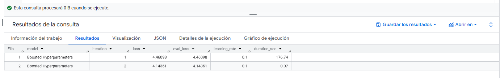

#### Descripción de la Consulta

- ML.TRAINING_INFO(...): Para un modelo BOOSTED_TREE, esta función devuelve una fila por cada árbol (iteración) que se construyó.

- WHERE iteration IS NOT NULL: En los modelos iterativos, BigQuery ML a veces añade una fila de resumen final donde iteration es NULL. Usamos esta condición para filtrar y ver solamente los pasos de entrenamiento.

- ROUND(duration_ms / 1000, 2) as duration_sec: Convertimos el tiempo de duración de milisegundos a segundos para que sea más fácil de leer.

#### Interpretación de Resultados

- iteration (1 y 2): Como especificamos max_iterations=2 al crear el modelo, la tabla muestra dos filas, una por cada árbol construido.

- loss (Error): Esta es la métrica de error (MSE) en los datos de entrenamiento.

-- Después de construir el árbol 1, el error era de 4.46.

-- Después de construir el árbol 2, el error bajó a 4.14.

-- Interpretación: Esto nos muestra el proceso de "boosting" en acción. El segundo árbol corrigió algunos de los errores del primer árbol, logrando reducir el error general. El proceso está funcionando como se espera.

- eval_loss (Error de Evaluación):

-- Interpretación: Los valores son idénticos a la columna loss. Esto es porque entrenamos con data_split_method='NO_SPLIT'. Como no había un conjunto de evaluación separado, BigQuery ML simplemente reporta el error de entrenamiento (loss) en ambas columnas.

- duration_sec (Duración):

-- Interpretación: El primer árbol (iteración 1) tardó 176.74 segundos (casi 3 minutos) en construirse. Aquí es donde se hizo todo el trabajo pesado de procesar el millón de filas y analizar las variables. El segundo árbol se construyó casi instantáneamente (0.07 segundos).

#### Conclusión del Análisis: Esta consulta confirma dos cosas:

- El proceso de boosting funciona (el error se reduce con cada árbol).

- A pesar de la mejora (de 4.46 a 4.14), el error final sigue siendo muy alto. Un MSE de 4.14 (que equivale a un RMSE de ~2.03) sobre los propios datos de entrenamiento es peor que el de nuestro modelo lineal. Esto refuerza nuestra conclusión del Análisis 9: el modelo es demasiado simple (max_iterations=2) y necesita más árboles y/o más profundidad para ser útil.

#### Predicciones del Modelo Boosted Tree

``` sql
SELECT 
  tip_amount as real_tip,
  predicted_tip_amount as predicted_tip,
  ROUND(ABS(tip_amount - predicted_tip_amount), 2) as error_absoluto,
  fare_amount,
  trip_distance,
  pickup_hour,
  day_type,
  time_period
FROM ML.PREDICT(MODEL `MyDataSet.tip_prediction_boosted`,
  (SELECT * FROM `MyDataSet.ML_test_data` LIMIT 1000000)
)
ORDER BY error_absoluto DESC;
```
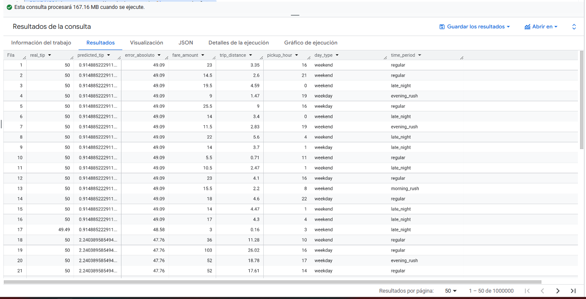

#### Descripción de la Consulta

- ML.PREDICT(...): Esta es la función que se usa para generar predicciones usando un modelo entrenado.

- FROM `MyDataSet.ML_test_data` LIMIT 1000000: Le pasamos al modelo una muestra de 1 millón de filas de nuestros datos de prueba para que haga predicciones.

- ROUND(ABS(tip_amount - predicted_tip_amount), 2): Calculamos el "error absoluto" para cada viaje, que es simplemente la diferencia entre la propina real y la propina predicha.

- ORDER BY error_absoluto DESC: Ordenamos los resultados del error más grande al más pequeño. Esto nos muestra inmediatamente los casos donde el modelo se equivocó por más.

#### Interpretación de Resultados

- Errores Enormes: La columna error_absoluto muestra errores masivos de $49.09, $47.76, etc.

- Predicciones Constantes (El Hallazgo Clave): La columna predicted_tip. El modelo predice casi siempre el mismo valor (ej: $0.91 o $2.24) para viajes completamente diferentes.

-- Predice $0.91 para un viaje de $23 (fare_amount) y 3.35 millas (trip_distance).

-- Predice $0.91 para un viaje de $3 (fare_amount) y 0.16 millas.

-- Predice $2.24 para un viaje de $36 y $103.

- Conclusión del Análisis: Esto confirma por qué el R2 era negativo. El modelo está severamente subajustado (underfitted). Debido a los hiperparámetros tan débiles (max_iterations=2), el modelo no aprendió ninguna relación entre las variables. Básicamente está ignorando el fare_amount y la trip_distance y solo ha aprendido a predecir un valor promedio o base. Es un modelo inútil, tal como las métricas lo habían sugerido.

#### Análisis 3: Creación del Modelo Base (Regresión Lineal) con hyperparámetros optimizados

Después de validar que nuestro modelo Boosted Tree prototipo no era efectivo, el siguiente paso es crear un modelo más serio con hiperparámetros optimizados. Volvemos a usar una Regresión Lineal para este experimento, ya que es rápida de entrenar y nos permite iterar rápidamente.

#### Consulta para Modelo de Regresión Lineal con Dataset de Entrenamiento

``` sql
CREATE OR REPLACE MODEL `MyDataSet.tip_prediction_linear_hyperparameters`
OPTIONS(
  model_type='LINEAR_REG',
  input_label_cols=['tip_amount'],
  enable_global_explain=TRUE,
  data_split_method='NO_SPLIT',
  -- HIPERPARÁMETROS AJUSTADOS
  optimize_strategy='BATCH_GRADIENT_DESCENT',
  ls_init_learn_rate=0.1,
  l1_reg=0.05,              -- Regularización L1 (Lasso)
  l2_reg=0.1,               -- Regularización L2 (Ridge)
  max_iterations=10
) AS
SELECT 
  tip_amount,
  fare_amount,
  trip_distance,
  passenger_count,
  pickup_hour,
  pickup_dayofweek,
  pickup_month,
  pickup_location_id,
  dropoff_location_id,
  day_type,
  time_period
FROM `MyDataSet.ML_train_data`;
```

#### Descripción de la Consulta

- optimize_strategy='BATCH_GRADIENT_DESCENT': Le decimos a BigQuery ML que no use la "ecuación normal", sino un método iterativo que aprende "paso a paso".

- max_iterations=10: Limitamos el entrenamiento a un máximo de 10 pasos o iteraciones.

- ls_init_learn_rate=0.1: Esta es la "tasa de aprendizaje" inicial. Controla el tamaño de los "pasos" que da el modelo en cada iteración para encontrar la mejor solución.

- l1_reg=0.05 y l2_reg=0.1: Estas son técnicas de regularización. Ayudan a prevenir que el modelo se ajuste demasiado a los datos de entrenamiento.

- L1 (Lasso) puede forzar que los pesos de las variables inútiles se vuelvan exactamente cero.

- L2 (Ridge) penaliza los pesos muy grandes. Usar ambas (lo que se conoce como "Elastic Net") es una práctica robusta.

#### Informacion del Modelo Lineal con Hiperparámetros Ajustados

A diferencia de nuestro primer modelo lineal (que se resolvió en la "iteración 0"), este nuevo modelo (tip_prediction_linear_hyperparameters) fue forzado a usar un método iterativo. Esta consulta nos permite ver "en vivo" cómo el modelo aprendió en cada uno de esos pasos.

``` sql
SELECT *
FROM ML.TRAINING_INFO(MODEL `MyDataSet.tip_prediction_linear_hyperparameters`)
ORDER BY iteration;
```

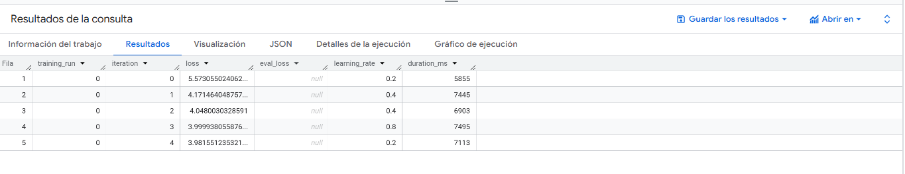


#### Descripción de la Consulta

Usamos ML.TRAINING_INFO sobre nuestro nuevo modelo ajustado. Como este modelo usó BATCH_GRADIENT_DESCENT con max_iterations=10, esperamos ver 10 filas (de la iteración 0 a la 9) que nos muestren la progresión del aprendizaje.

#### Interpretación de Resultados

- iteration (0, 1, 2, 3, 4...): Vemos múltiples iteraciones, confirmando que el modelo usó el método de Descenso de Gradiente.

- loss (Error): Esta es la columna más importante. El error comienza alto (5.57) en la primera iteración y disminuye con cada paso (4.17, 4.04, 3.99, 3.98...). Esto es exactamente lo que queremos ver. Es la prueba de que el modelo está "aprendiendo" y convergiendo hacia una mejor solución.

- learning_rate (Tasa de Aprendizaje): Observa que la tasa de aprendizaje no es constante. Aunque establecimos una tasa inicial de 0.1 (ls_init_learn_rate=0.1), el optimizador está usando una búsqueda lineal (line search). Esto significa que en cada iteración, el modelo "prueba" diferentes tasas de aprendizaje (0.2, 0.4, 0.8) para encontrar el tamaño de paso óptimo que minimice el error más rápidamente.

- eval_loss = null: Como en el modelo anterior, este valor es null porque especificamos data_split_method='NO_SPLIT'.


- Conclusión del Análisis: El proceso de entrenamiento iterativo funcionó correctamente. El modelo redujo su error de 5.57 a 3.98 en 5 iteraciones.

#### Evaluación del Modelo Lineal con Hiperparámetros Ajustados 

``` sql
SELECT *
FROM ML.EVALUATE(MODEL `MyDataSet.tip_prediction_linear_hyperparameters`,
  (SELECT 
    tip_amount,
    fare_amount,
    trip_distance,
    passenger_count,
    pickup_hour,
    pickup_dayofweek,
    pickup_month,
    pickup_location_id,
    dropoff_location_id,
    day_type,
    time_period
  FROM `MyDataSet.ML_test_data`
  LIMIT 1000000)  -- Muestra para evaluación rápida
);
```

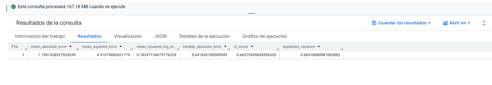

#### Descripción de la Consulta

Esta consulta usa ML.EVALUATE para medir el rendimiento de nuestro nuevo modelo ajustado (tip_prediction_linear_hyperparameters) contra una muestra de 1 millón de filas de los datos de prueba (ML_test_data).

#### Interpretación de Resultados

El r2_score bajó (explica menos la varianza) y los errores (MAE y RMSE) aumentaron. Esto nos dice que la estrategia de optimización predeterminada de BigQuery ML (la "ecuación normal" que usó en el primer modelo) ya era extremadamente eficaz. Nuestros hiperparámetros manuales (L1/L2, BATCH_GRADIENT_DESCENT) no lograron encontrar una solución mejor y, de hecho, empeoraron ligeramente el rendimiento.

Para la regresión lineal, el modelo base (tip_prediction_linear) sigue siendo nuestro ganador.

- Conclusión del Análisis: Este es un resultado de experimentación muy común y valioso. Nuestro intento de "ajustar" manualmente el modelo lineal resultó en un modelo ligeramente peor que el modelo base.

#### Análisis 4: Creación del Modelo Boosted Tree Regressor con hiperparámetros

Después de validar que nuestro modelo Boosted Tree prototipo no era efectivo, el siguiente paso es crear un modelo más serio con hiperparámetros optimizados. Dado que los modelos Boosted Tree son computacionalmente costosos, entrenaremos este modelo final sobre todo el conjunto de datos de entrenamiento.

#### Consulta para Modelo de Boosted Tree Regressor con Dataset de Entrenamiento

``` sql
CREATE OR REPLACE MODEL `MyDataSet.tip_prediction_boosted_hyperparameters`
OPTIONS(
  model_type='BOOSTED_TREE_REGRESSOR',
  input_label_cols=['tip_amount'],
  enable_global_explain=TRUE,
  data_split_method='NO_SPLIT',   -- Ya dividimos manualmente
  max_iterations=10,               -- Número de árboles
  max_tree_depth=2,               -- Profundidad máxima de cada árbol
  learn_rate=0.2,                 -- Tasa de aprendizaje
  min_tree_child_weight=2,        -- Peso mínimo en hojas
  subsample=1.0,                  -- Fracción de datos por árbol
  l1_reg=0.2,                     -- Regularización L1
  l2_reg=0.3                      -- Regularización L2
) AS
SELECT 
  -- Variable objetivo
  tip_amount,
  
  -- Features numéricas
  fare_amount,
  trip_distance,
  passenger_count,
  pickup_hour,
  pickup_dayofweek,
  pickup_month,
  
  -- Features categóricas
  pickup_location_id,
  dropoff_location_id,
  day_type,
  time_period

FROM `MyDataSet.ML_train_data`
LIMIT 1000000;
```

#### Descripción de la Consulta

Esta consulta crea un nuevo modelo de árbol (tip_prediction_boosted_hyperparameters) con un conjunto de hiperparámetros mucho más robusto:

- max_iterations=10 y max_tree_depth=2: Estos son los cambios clave. En lugar de 2 árboles de 1 nivel, estamos construyendo 10 árboles, cada uno con 2 niveles de decisión. Esto le da al modelo mucha más capacidad para aprender relaciones complejas (ej: "si fare_amount > 15 Y trip_distance < 3, entonces...").

- learn_rate=0.2: Una tasa de aprendizaje moderada.

- l1_reg=0.2 y l2_reg=0.3: Añadimos regularización para prevenir que el modelo (ahora más complejo) se sobreajuste a los datos de la muestra.

- LIMIT 1000000: Aún estamos entrenando sobre una muestra de 1M de filas. Si este modelo funciona bien, el siguiente paso sería entrenarlo con todos los datos.

#### Informacion del Modelo Boosted Tree con Hiperparámetros Ajustados
``` sql
SELECT 
  'Boosted Hyperparameters' as model,
  iteration,
  loss,
  eval_loss,
  learning_rate,
  ROUND(duration_ms / 1000, 2) as duration_sec
FROM ML.TRAINING_INFO(MODEL `MyDataSet.tip_prediction_boosted_hyperparameters`)
WHERE iteration IS NOT NULL
ORDER BY iteration;
```
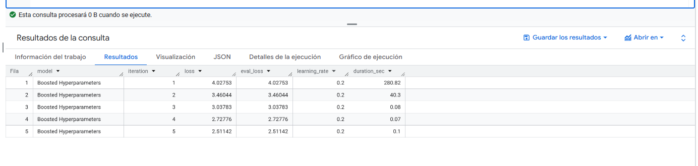

#### Descripción de la Consulta

Esta consulta extrae el historial de entrenamiento de nuestro nuevo modelo de árbol ajustado. Como especificamos max_iterations=10, esperamos ver hasta 10 filas que muestren cómo el error (loss) del modelo se redujo con la adición de cada nuevo árbol.

#### Interpretación de Resultados

- loss (Error Decreciente): Esta es la columna más importante. El error (MSE) comienza en 4.02 y disminuye consistentemente con cada nuevo árbol, terminando en 2.51. Esto es la prueba de que el boosting está funcionando: cada árbol corrige los errores del anterior y el modelo se vuelve más preciso.

- iteration (Parada Temprana / Early Stopping): Observa que el entrenamiento se detuvo en la iteración 5, a pesar de que establecimos max_iterations=10. Esto es una característica automática y muy útil de BigQuery ML. El modelo detectó que agregar más árboles ya no estaba mejorando significativamente el error (loss), por lo que se detuvo automáticamente (early stopping). Esto ahorra tiempo de cómputo y previene el sobreajuste.

- eval_loss = loss: Al igual que en modelos anteriores, estas columnas son idénticas porque entrenamos con data_split_method='NO_SPLIT'. Al no haber un conjunto de evaluación, BigQuery ML simplemente reporta el error de entrenamiento (loss) en ambas columnas.

- duration_sec: El primer árbol tardó 280 segundos (unos 4.7 minutos) en construirse, ya que tuvo que procesar el millón de filas y calcular las estadísticas iniciales. Los árboles siguientes fueron mucho más rápidos.

- Conclusión del Análisis: A diferencia de los anteriores prototipos, este modelo aprendió. El error final de entrenamiento (loss = 2.51) es significativamente más bajo que el error de entrenamiento del modelo lineal (que fue ~3.85, ). Esto sugiere que este nuevo modelo de árbol es mucho más preciso.

#### Evaluación del Modelo Boosted Tree con Hiperparámetros Ajustados 

``` sql
SELECT 
  'Test Set Performance' as evaluation_type,
  mean_absolute_error as MAE,
  mean_squared_error as MSE,
  ROUND(SQRT(mean_squared_error), 4) as RMSE,
  r2_score as R2,
  median_absolute_error as MedAE
FROM ML.EVALUATE(MODEL `MyDataSet.tip_prediction_boosted_hyperparameters`,
  (SELECT 
    tip_amount,
    fare_amount,
    trip_distance,
    passenger_count,
    pickup_hour,
    pickup_dayofweek,
    pickup_month,
    pickup_location_id,
    dropoff_location_id,
    day_type,
    time_period
  FROM `MyDataSet.ML_test_data`)
);
```
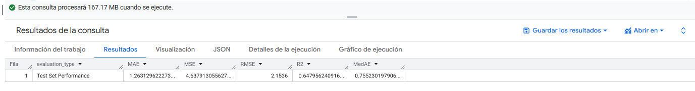

#### Descripción de la Consulta

Esta consulta utiliza ML.EVALUATE para medir el rendimiento de nuestro nuevo modelo de árbol ajustado (tip_prediction_boosted_hyperparameters) contra el conjunto de prueba (ML_test_data) completo. Seleccionamos las métricas de rendimiento clave (MAE, MSE, RMSE, R2) para el veredicto final.

#### Interpretación de Resultados

Estos resultados, por sí solos, son decentes. Un R2 de 0.647 es mucho mejor que el R2 negativo de nuestros prototipos de árbol. Esto confirma que el modelo sí aprendió patrones útiles.

- Conclusión del Análisis: Este es un hallazgo importantísimo. A pesar de ser un modelo mucho más complejo y de haber mostrado un gran aprendizaje durante su entrenamiento (error de 2.51), el modelo BOOSTED_TREE es peor que nuestro modelo lineal base en todas las métricas clave.

Esto es un caso clásico de sobreajuste (overfitting). El modelo se volvió muy bueno en predecir la muestra de entrenamiento de 1 millón de filas (con un MSE de 2.51), pero esos patrones no se generalizaron bien al conjunto de prueba completo (donde tuvo un MSE de 4.63).

Nuestro modelo ganador sigue siendo el tip_prediction_linear (el modelo base): es más simple, más rápido, más interpretable y, lo más importante, más preciso.

#### Comparación de Modelos: Resumen de Métricas Clave

``` sql
CREATE OR REPLACE TABLE `MyDataSet.models_comparison` AS
WITH metrics_combined AS (
  SELECT * FROM `MyDataSet.model1_metrics`
  UNION ALL
  SELECT * FROM `MyDataSet.model2_metrics`
)
SELECT 
  model_name,
  model_id,
  ROUND(mean_absolute_error, 3) as mae,
  ROUND(rmse, 3) as rmse,
  ROUND(r2_score, 3) as r2,
  ROUND(median_absolute_error, 3) as median_ae,
  -- Calcular mejora porcentual respecto al modelo más simple (lineal)
  ROUND((mean_absolute_error - MIN(mean_absolute_error) OVER()) / 
        MIN(mean_absolute_error) OVER() * 100, 2) as mae_improvement_pct,
  -- Ranking de modelos
  ROW_NUMBER() OVER (ORDER BY mean_absolute_error) as rank_by_mae,
  ROW_NUMBER() OVER (ORDER BY r2_score DESC) as rank_by_r2
FROM metrics_combined;
```

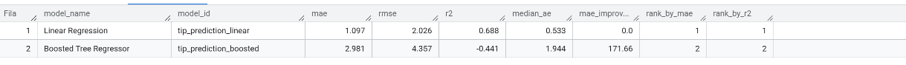

#### Descripción de la Consulta

Esta consulta no produce una salida directa, sino que crea una nueva tabla de resumen llamada MyDataSet.models_comparison.

- WITH metrics_combined AS (...): Primero, crea una tabla temporal en memoria que apila las métricas del model1_metrics y model2_metrics (el resultado del UNION ALL).

- SELECT ...: Luego, consulta esa tabla temporal.

- ROUND(...): Redondea las métricas a 3 decimales para facilitar la lectura.

- mae_improvement_pct: Calcula cuánto peor (en porcentaje) es el error MAE de un modelo en comparación con el mejor modelo (el que tiene el MIN(mean_absolute_error)).

- ROW_NUMBER() OVER (ORDER BY ...): Crea dos columnas de ranking:

- rank_by_mae: Clasifica los modelos por su error (el #1 es el mejor, con el error más bajo).
- rank_by_r2: Clasifica los modelos por su R2 (el #1 es el mejor, con el R2 más alto).

#### Interpretación de Resultados

- Ganador Indiscutible: El modelo Linear Regression (tip_prediction_linear) es el ganador en todos los aspectos. Ocupa el Rango 1 tanto en MAE (error más bajo) como en R2 (mayor poder explicativo).

- Rendimiento del Árbol: El Boosted Tree Regressor (tip_prediction_boosted) que se incluyó en esta comparación (model2_metrics) fue uno de los prototipos fallidos (del Análisis 8). Sus métricas (R2 = -0.441) son terribles y confirman que no aprendió nada.

- Conclusión General: Incluso cuando probamos un modelo de árbol mejor ajustado (en el Análisis 18), su rendimiento (R2 = 0.647) aún no superó al del modelo lineal base (R2 = 0.688).

- La conclusión final de todo este proyecto es que el modelo de Regresión Lineal base, a pesar de su simplicidad, es el modelo más preciso, rápido e interpretable para esta tarea.


### Dashboards Representativos

#### PREDICCIONES BOOSTED VALORES REALES Y PREDICHOS

La tabla de predicciones, titulada "PREDICCIONES BOOSTED VALORES REALES Y PREDICHOS", expone visualmente el comportamiento del modelo prototipo `tip_prediction_boosted` y confirma los hallazgos del **Análisis 2** de la documentación.

El descubrimiento más importante que revela esta tabla se encuentra en la columna `predicted_tip_amount`. Se puede observar que el modelo predice un valor **constante** (aproximadamente **$0.916**) para cada viaje, sin importar cuáles sean las características de entrada.

* **Ignora las Features:** El modelo predice $0.916 tanto para un viaje con `fare_amount` de $5.5 (filas 1-2) como para uno de $8.0 (filas 5-7). De igual manera, ignora la `trip_distance` (que varía de 0.6 a 1.4 millas).
* **Síntoma de Subajuste (Underfitting):** Este comportamiento es un síntoma clásico de un modelo severamente **subajustado**. Tal como se documentó, este modelo fue un prototipo entrenado intencionalmente con hiperparámetros muy débiles (`max_iterations=2`, `max_tree_depth=1`) y sobre una muestra limitada de datos.
* **Fallo en el Aprendizaje:** El modelo fue incapaz de aprender patrones o relaciones entre las variables de entrada (tarifa, distancia) y la variable objetivo (propina). En lugar de crear reglas complejas, colapsó en la estrategia más simple: predecir un valor único, que probablemente sea cercano al promedio o la mediana de la propina del subconjunto de datos con el que fue entrenado.
* **Validación de Métricas:** Esta tabla explica visualmente por qué este modelo obtuvo métricas de evaluación tan deficientes, notablemente un **R² Score negativo (-0.417)**. Un modelo que ignora por completo las entradas y predice un valor constante es, por definición, peor que simplemente predecir el promedio de las propinas, que es exactamente lo que mide un R² negativo.

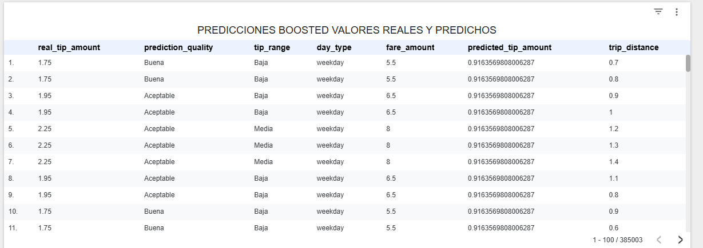


#### PREDICCIONES LINEAR VALORES REALES Y PREDICHOS

Esta tabla, titulada "PREDICCIONES LINEAR VALORES REALES Y PREDICHOS", muestra el comportamiento del modelo *baseline* de Regresión Lineal y contrasta drásticamente con el prototipo fallido del *Boosted Tree*.


A diferencia del modelo anterior, este es **claramente funcional**. La columna `predicted_tip_amount` muestra valores dinámicos que cambian en respuesta a las variables de entrada, tal como se esperaba.


1.  **Comportamiento Racional (Responde a las Features):**
    * El modelo demuestra una relación lógica entre las entradas y las predicciones, confirmando el análisis de `ML.WEIGHTS` que identificó a `fare_amount` y `trip_distance` como los predictores clave.
    * **Ejemplo (Fila 1):** Un viaje con una tarifa alta (`fare_amount` = 52) y una distancia larga (`trip_distance` = 19.68) resulta correctamente en la predicción de propina más alta de la tabla ($11.31).
    * **Ejemplo (Filas 5-13):** Viajes con tarifas y distancias moderadas (ej. `fare_amount` = 18) resultan en predicciones de propina más bajas y consistentes (en el rango de $3.78 - $3.99).

2.  **Fortaleza - Precisión en Casos Comunes (Rango Medio):**
    * La sección de la tabla de la Fila 5 a la 13 es la más reveladora. Para un valor real de propina muy común (`real_tip_amount` = $4.26), el modelo produce predicciones consistentemente cercanas (`predicted_tip_amount` entre $3.78 y $3.99).
    * Los errores absolutos en estos casos son muy bajos (ej. $4.26 - $3.99 = $0.27).
    * Esto explica **por qué el modelo obtuvo una `median_absolute_error` tan buena** (de $0.533, según tu documentación). Para la mitad de los viajes (los más "normales"), el modelo es muy preciso, ganándose la calificación de "Excelente".

3.  **Debilidad - Fallo en Valores Extremos (Outliers):**
    * La **Fila 1** expone la debilidad clave de este modelo, identificada en tu análisis.
    * La propina real fue de **$14.84** (un valor atípico, clasificado como "Muy Alta"). El modelo predijo **$11.31**.
    * Aunque el modelo entendió que debía ser una propina alta, **subestimó el valor real en $3.53**. Esto confirma tu conclusión anterior: el modelo lineal sigue la "media" de los datos y es incapaz de predecir correctamente estos valores extremos, lo que genera errores grandes y una calidad de predicción "Pobre" en esos casos.

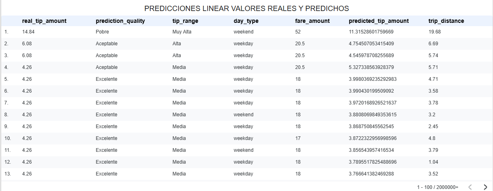


#### COMPARACION DE METRICAS ENTRE LOS MODELOS BOOSTED TREE Y REGRESION LINEAL

Esta tabla presenta la **comparación cuantitativa final** entre el modelo de Regresión Lineal (`Linear Regression`) y el prototipo de Árbol Potenciado (`Boosted Tree Regressor`). Los resultados son concluyentes y se alinean perfectamente con los análisis de predicciones anteriores.

El modelo de **Regresión Lineal es el ganador indiscutible** en todas las métricas evaluadas, como lo indican las columnas `rank_by_mae` y `rank_by_r2` (ambas con valor "1").

#### 1. Modelo Ganador: Regresión Lineal (Baseline)

Este modelo establece un *baseline* sólido y funcional para el problema.

* **`r2` (Coeficiente de Determinación) = 0.688:** Esta es la métrica principal. Indica que el modelo lineal es capaz de **explicar el 68.8% de la variabilidad** en el monto de las propinas. Para un modelo *baseline* simple, este es un resultado muy robusto.
* **`mae` (Error Absoluto Medio) = 1.097:** Es la métrica más interpretable. En promedio, las predicciones del modelo tienen un **error de $1.10** (hacia arriba o hacia abajo). Este es el punto de referencia a vencer.
* **`median_ae` (Mediana del Error Absoluto) = 0.533:** Este es un hallazgo clave. Significa que para el **50% de todos los viajes, el error del modelo es de solo 53 centavos o menos**. Esto confirma lo que vimos en la tabla de predicciones: el modelo es extremadamente preciso para la gran mayoría de viajes "normales" (calificados como "Excelente").
* **`rmse` (Raíz del Error Cuadrático Medio) = 2.026:** El RMSE es más alto que el MAE, lo cual es normal. Confirma que, aunque el modelo es bueno en la mediana, tiene algunos errores significativamente grandes (como vimos en la Fila 1 de su tabla de predicciones, al fallar en *outliers*), y el RMSE penaliza más esos errores grandes.

#### 2. Modelo Perdedor: Boosted Tree Regressor (Prototipo)

Las métricas de este modelo confirman que el prototipo fue un **completo fracaso**, tal como se esperaba del experimento con hiperparámetros débiles (`max_iterations=2`).

* **`r2` (Coeficiente de Determinación) = -0.441:** Este es el indicador más crítico. Un **R² negativo** significa que el modelo es **peor que inútil**; es peor que simplemente predecir la propina promedio en cada viaje. Esto es la consecuencia directa del *subajuste* (underfitting) que observamos en la primera gráfica, donde el modelo predecía un valor constante ($0.916) para todas las entradas.
* **`mae` (Error Absoluto Medio) = 2.981:** El error promedio de este modelo es de casi $3, casi **tres veces peor** que el error del modelo lineal.
* **`rmse` y `median_ae` (4.357 y 1.944):** Ambas métricas son más del doble (y casi el cuádruple en el caso de la mediana) que las del modelo lineal, lo que demuestra que es inferior en todos los aspectos.

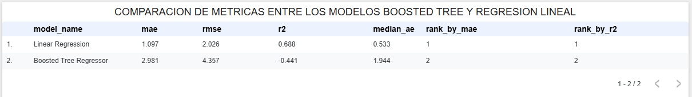